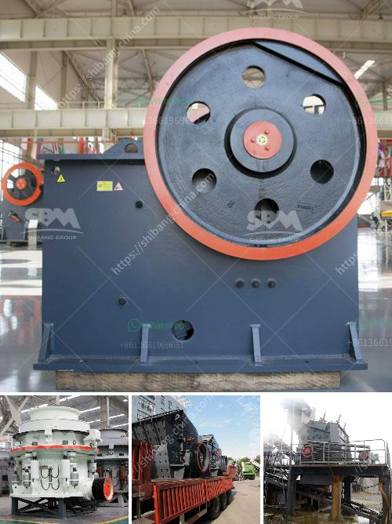

<h3>conveyor belt for sale in south africa</h3>
Conveyor belts are used in various industries such as automotive, food processing, pharmaceutical, and manufacturing to move materials from one point to another. A conveyor belt is a highly efficient and cost-effective method of transporting goods, making it an ideal choice for many businesses.

If you are in South Africa and looking for a reliable conveyor belt for your operations, there are numerous options available to you. Many companies specialize in the manufacture and sale of conveyor belts, catering to the diverse needs of different industries.

When purchasing a conveyor belt in South Africa, it is essential to consider certain factors to ensure that you make the right choice for your business. Firstly, you need to determine the type of conveyor belt that suits your requirements. There are various types available, including flat belts, modular belts, magnetic belts, and rubber belts, each designed to handle specific materials and applications.

Furthermore, you need to consider the size and capacity of the conveyor belt. Depending on the volume of materials you need to transport, you must choose a belt that can handle the workload efficiently. Additionally, it is crucial to consider the speed and power requirements of the conveyor belt, ensuring that it aligns with your business's operational needs.

In South Africa, you will find conveyor belts for sale from both local manufacturers and international suppliers. Local suppliers offer the advantage of being readily available and providing quick turnaround times. On the other hand, international suppliers may offer a wider range of conveyor belt options and expertise in specific industries.

Whether you choose a local or international supplier, it is vital to ensure that the conveyor belt meets industry standards and regulations. This ensures the safety and integrity of your business operations and protects the wellbeing of your employees.

In conclusion, if you are looking for a conveyor belt for sale in South Africa, you have multiple options to choose from. Take into consideration the type, capacity, speed, and power requirements of the belt, ensuring it aligns with your business needs. Lastly, opt for a supplier that meets industry standards and offers reliable and efficient customer services.
<h3>Contact us</h3><ul><li><strong>Whatsapp:&nbsp;<a href="https://wa.me/8613661969651">+8613661969651</a></strong></li><li><a href="https://swt.shibang-china.com/?git&amp;zhl&amp;conveyor belt for sale in south africa"><strong>Online Service(chat now)</strong></a></li></ul><h3>Related</h3><ul><li><a href='clay graphite grinding process.md'>clay graphite grinding process</a></li><li><a href='coal ball mill in india from coal dust.md'>coal ball mill in india from coal dust</a></li><li><a href='grinding mill for limestone italy.md'>grinding mill for limestone italy</a></li><li><a href='rotary dryer for sale in india.md'>rotary dryer for sale in india</a></li><li><a href='barite mill in india.md'>barite mill in india</a></li></ul>