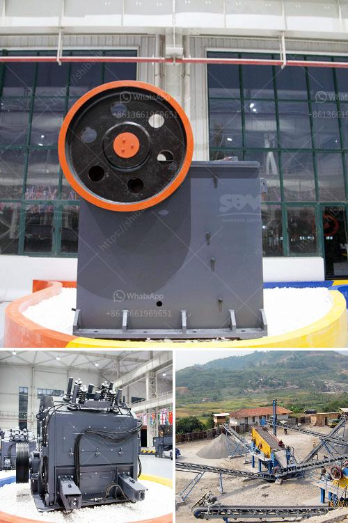

<h3>conveyor belt laying procedure</h3>
Conveyor belts are an essential component of many industries, helping to transport materials efficiently from one location to another. Whether it's in manufacturing plants, warehouses, or even mining sites, the proper installation of conveyor belts is crucial to ensure smooth operations. In this article, we will outline a step-by-step guide on the conveyor belt laying procedure.

Before starting the actual laying process, meticulous planning and preparation are required. Evaluate the site and determine the ideal layout for the conveyor belts. Consider factors such as accessibility, spacing, and the overall flow of materials. This will help minimize any potential bottlenecks or operational issues.

Safety is of paramount importance throughout the entire laying process. Ensure that all workers involved are equipped with personal protective equipment (PPE) such as safety shoes and helmets. Adhere to safety guidelines and regulations to prevent accidents or injuries.

Clear the area where the conveyor belt will be laid, removing any debris, obstacles, or obstructions. Create a smooth and clean working surface to facilitate the installation process. It is essential to have a solid foundation, so a concrete base may be required depending on the specific needs of the site.

Carefully unroll the conveyor belt along the planned path, ensuring that it is aligned correctly. Depending on the length and weight of the belt, additional workers or machinery may be needed to assist in this process. The belt should be unrolled smoothly and without any twists or kinks.

Adjust the tension of the conveyor belt to ensure proper functionality. Too much tension can result in premature wear and damage, while insufficient tension can cause slippage or material spillage. Utilize tensioning systems, such as take-ups or pulleys, to achieve the correct tension. Additionally, align the belt properly with the rollers and idlers to guarantee smooth operation throughout the system's entire length.

If the conveyor belt comes in multiple sections, splicing or jointing is necessary. This process involves connecting the belt ends securely, creating a continuous, seamless surface. Various splicing methods are available, such as vulcanization, mechanical fasteners, or cold bonding. Select the appropriate method based on the belt type and application.

After the installation is complete, conduct a thorough inspection of the conveyor belt system. Test its functionality by running it empty and observing its performance. Make any necessary adjustments to ensure its optimal operation, such as aligning the belts, adjusting tension, or checking for any potential issues.

In conclusion, the proper laying process of a conveyor belt is critical for its optimal performance and efficiency. By following this step-by-step guide, industries can ensure the successful installation and operation of conveyor belts, improving productivity and safety within their operations.
<h3>Contact us</h3><ul><li><strong>Whatsapp:&nbsp;<a href="https://wa.me/8613661969651">+8613661969651</a></strong></li><li><a href="https://swt.shibang-china.com/?git&amp;zhl&amp;conveyor belt laying procedure"><strong>Online Service(chat now)</strong></a></li></ul><h3>Related</h3><ul><li><a href='business plan south africa stone crusher.md'>business plan south africa stone crusher</a></li><li><a href='calcium carbonate grinder mill.md'>calcium carbonate grinder mill</a></li><li><a href='stone crushing plant keesara.md'>stone crushing plant keesara</a></li><li><a href='stone crushing equipment price in nigeria.md'>stone crushing equipment price in nigeria</a></li><li><a href='quarry crusher equipment for sale brisbane.md'>quarry crusher equipment for sale brisbane</a></li></ul>