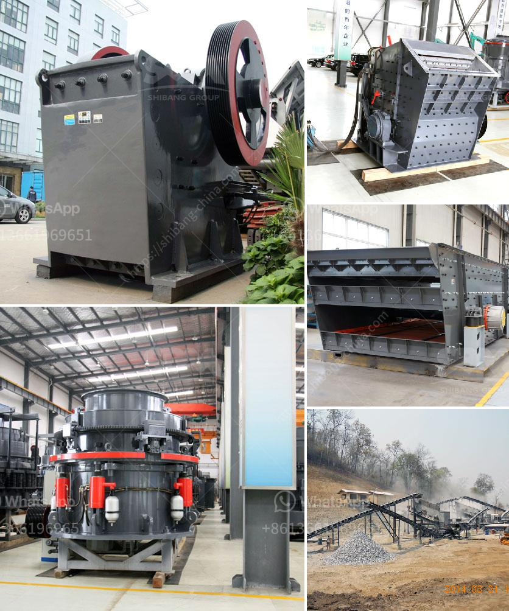

<h3>conveyor belt manufacturer in indonesia and philippines</h3>
When it comes to the manufacturing industry, conveyor belts are essential for efficiency and smooth operations. Conveyor belts help transport materials and products from one point to another, reducing manual labor and increasing productivity. In Southeast Asia, two countries stand out in conveyor belt manufacturing - Indonesia and the Philippines.

Indonesia is known for its rich natural resources and diverse industries. Conveyor belt manufacturers in Indonesia are known for their innovative products and reliable services. With a wide range of conveyor belts available, these manufacturers cater to various industries such as mining, construction, food processing, automotive, and manufacturing.

One leading conveyor belt manufacturer in Indonesia is PT. Sentra Aneka Tama. Their extensive range of products include textile and steel cord conveyor belts, solid woven belts, and conveyor equipment. With over 35 years of experience in the conveyor belt industry, PT. Sentra Aneka Tama has established itself as a reliable and reputable conveyor belt manufacturer in Indonesia.

In the Philippines, conveyor belt manufacturing has expanded steadily over the years. Companies like Philippine Belt Manufacturing Corporation (Philbelt) have been serving local industries since 1971. With their highly durable and reliable conveyor belts, Philbelt has become a leading name in the Philippines.

Philbelt offers a wide range of conveyor belts for various applications, including mining, food processing, manufacturing, and agriculture. Their conveyor belts are built to withstand extreme conditions and provide consistent performance, ensuring smooth operations and increased productivity.

Both Indonesia and the Philippines have cemented their positions as notable conveyor belt manufacturers in Southeast Asia. Their commitment to quality, innovation, and customer satisfaction has enabled these countries to meet the demands of the manufacturing industry effectively.

With the continuous development of industries and the need for efficient material handling, conveyor belt manufacturers in Indonesia and the Philippines are poised for further growth. Their expertise and dedication to providing high-quality conveyor belts will continue to support the manufacturing industry in these countries and contribute to their economic growth.
<h3>Contact us</h3><ul><li><strong>Whatsapp:&nbsp;<a href="https://wa.me/8613661969651">+8613661969651</a></strong></li><li><a href="https://swt.shibang-china.com/?git&amp;zhl&amp;conveyor belt manufacturer in indonesia and philippines"><strong>Online Service(chat now)</strong></a></li></ul><h3>Related</h3><ul><li><a href='limestone making size.md'>limestone making size</a></li><li><a href='dealers of mobile jaw crusher in kenya.md'>dealers of mobile jaw crusher in kenya</a></li><li><a href='river sand washing machine portable india.md'>river sand washing machine portable india</a></li><li><a href='used sweco screening equipment for sale.md'>used sweco screening equipment for sale</a></li><li><a href='price of world largest stone crushing plant.md'>price of world largest stone crushing plant</a></li></ul>