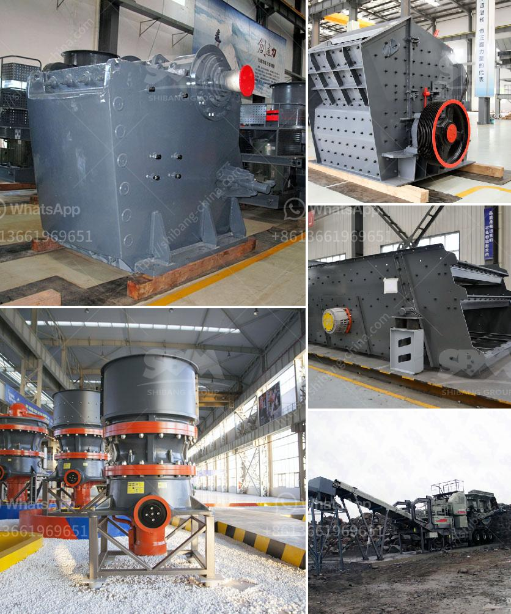

<h3>conveyor belt manufacturer in indonesia in philippines</h3>
Indonesia is a vibrant country located in Southeast Asia. It is known for its rich natural resources, diverse cultural heritage, and bustling economy. One of the sectors that contribute significantly to its economic growth is the manufacturing industry, which encompasses various sub-sectors. One such sub-sector is the production of conveyor belts, which plays a vital role in facilitating the movement of goods across different industries.

Indonesia has established itself as a reputed conveyor belt manufacturer, catering not only to the demands of the local market but also to international clients. With a strong manufacturing base and a skilled workforce, Indonesian companies have made a significant mark in the global conveyor belt market. Their products are highly sought after due to their exceptional quality, durability, and cost-effectiveness.

These Indonesian manufacturers have also made considerable inroads in the Philippines, a neighboring country with a similar manufacturing industry. The Philippines, like Indonesia, has a rapidly expanding economy that heavily relies on the manufacturing sector. With the increasing demand for conveyor belts in the Philippines, Indonesian manufacturers have capitalized on this opportunity to expand their market presence.

The conveyor belt industry in the Philippines has witnessed a steady growth over the years, driven by the need for efficient transportation and movement of goods. Industries such as mining, agriculture, food processing, and logistics heavily rely on conveyor belts for their day-to-day operations. Indonesian manufacturers have successfully tapped into this demand by providing high-quality conveyor belts that meet international standards.

What sets Indonesian conveyor belt manufacturers apart from their competitors is their commitment to innovation and technology. They constantly invest in research and development, ensuring that their products are at the forefront of industry trends. With the advent of advanced materials and manufacturing techniques, Indonesian manufacturers have been able to produce conveyor belts that are not only durable but also environmentally friendly.

Furthermore, Indonesian conveyor belt manufacturers prioritize customer satisfaction by offering tailored solutions to meet specific requirements. They work closely with their clients to understand their needs and provide comprehensive support, from the design stage to installation and maintenance. This customer-centric approach has earned them a loyal customer base in the Philippines, further solidifying their position as a trusted conveyor belt manufacturer.

To ensure the efficient supply of conveyor belts to the Philippines, Indonesian manufacturers have also established a robust network of distributors and agents. These partnerships enable them to reach different regions in the Philippines and cater to the diverse needs of various industries. The presence of local support and after-sales service has further bolstered the reputation of Indonesian manufacturers in the Philippines.

In conclusion, the conveyor belt manufacturing industry in Indonesia has thrived due to its commitment to quality, innovation, and customer satisfaction. Indonesian manufacturers have successfully extended their market presence to the Philippines, capitalizing on the country's growing demand for conveyor belts. With their excellent products and strong customer support, Indonesian conveyor belt manufacturers continue to be a formidable force in the industry, contributing to the growth of both their home country and the Philippines.
<h3>Contact us</h3><ul><li><strong>Whatsapp:&nbsp;<a href="https://wa.me/8613661969651">+8613661969651</a></strong></li><li><a href="https://swt.shibang-china.com/?git&amp;zhl&amp;conveyor belt manufacturer in indonesia in philippines"><strong>Online Service(chat now)</strong></a></li></ul><h3>Related</h3><ul><li><a href='crusher plant made in pakistan price.md'>crusher plant made in pakistan price</a></li><li><a href='magnetic enrichment of manganese ore.md'>magnetic enrichment of manganese ore</a></li><li><a href='grinder mill bogota.md'>grinder mill bogota</a></li><li><a href='stone quarry crusher equipment.md'>stone quarry crusher equipment</a></li><li><a href='coal processing plant in australia.md'>coal processing plant in australia</a></li></ul>