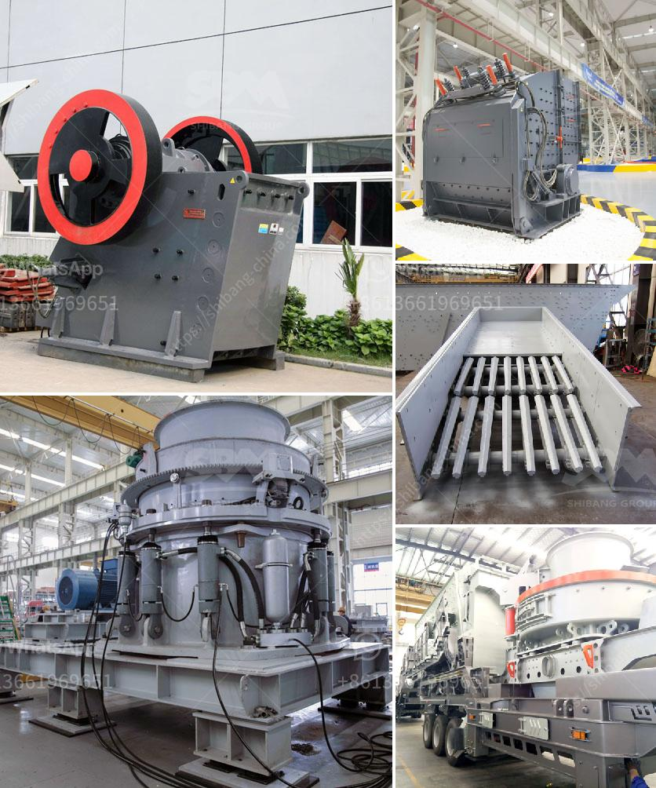

<h3>conveyor belt manufacturers in kolkata</h3>
Conveyor Belt Manufacturers in Kolkata: Catering to the Material Handling Needs of Multiple Industries

Conveyor belts are used in various industries for carrying raw materials, finished goods, and products along various stages of production. With the increasing automation and modernization of manufacturing processes, conveyor belts have witnessed a significant rise in demand. This has led to the emergence of several conveyor belt manufacturers in Kolkata, a major industrial city in India.

Kolkata, also known as the 'City of Joy,' has a thriving industrial sector, encompassing diverse industries such as steel, textiles, pharmaceuticals, food processing, and more. With the expansion of these industries, the demand for efficient and reliable material handling systems, including conveyor belts, has increased.

Conveyor belt manufacturers in Kolkata take pride in producing high-quality, durable, and efficient conveyor belts to meet the ever-growing demands of various industries. These manufacturers use the latest technology and expertise to design and manufacture conveyor belts that can withstand heavy loads, extreme temperatures, and harsh operating conditions.

One of the key advantages of choosing conveyor belt manufacturers in Kolkata is the availability of customization options. These manufacturers understand that every industry has unique material handling requirements. Therefore, they offer tailor-made conveyor belt solutions to ensure seamless integration with the existing production setup.

In Kolkata, conveyor belt manufacturers cater to various industries, including steel plants. Steel manufacturing involves intense heat, heavy loads, and rugged working conditions. Conveyor belts used in the steel industry need to be exceptionally robust and resistant to high temperatures. Manufacturers in Kolkata produce conveyor belts using heat-resistant materials such as steel and nylon to meet this requirement.

Another industry that benefits from conveyor belt manufacturers in Kolkata is the food processing industry. Conveyor belts used in the food industry must comply with strict hygiene and safety regulations. Kolkata manufacturers produce food-grade conveyor belts that are easy to clean and maintain, ensuring the highest standards of food safety.

Additionally, conveyor belts are widely utilized in the pharmaceutical industry to transport delicate and sensitive products. Kolkata manufacturers understand the need for gentle handling of pharmaceutical products and thus design conveyor belts with specialized materials and features that minimize product damage and contamination risks.

Conveyor belt manufacturers in Kolkata not only focus on product quality but also offer excellent after-sales service. They provide installation, maintenance, and repair services to ensure the smooth and uninterrupted operation of conveyor belts. This comprehensive support further enhances the reliability and longevity of their products, gaining the trust of their customers.

In conclusion, the conveyor belt manufacturers in Kolkata play a crucial role in meeting the material handling needs of multiple industries. With their technologically advanced solutions, customizable options, and excellent after-sales service, these manufacturers have become trusted partners for industries in Kolkata and beyond. As the industrial sector continues to thrive and expand, the demand for conveyor belts is expected to rise, further fueling the growth of conveyor belt manufacturers in Kolkata.
<h3>Contact us</h3><ul><li><strong>Whatsapp:&nbsp;<a href="https://wa.me/8613661969651">+8613661969651</a></strong></li><li><a href="https://swt.shibang-china.com/?git&amp;zhl&amp;conveyor belt manufacturers in kolkata"><strong>Online Service(chat now)</strong></a></li></ul><h3>Related</h3><ul><li><a href='automatic rolling mill manufacturer liberia.md'>automatic rolling mill manufacturer liberia</a></li><li><a href='ball mill for silica grinding made in japan.md'>ball mill for silica grinding made in japan</a></li><li><a href='conveyor belt manufacturer in indonesia in philippines.md'>conveyor belt manufacturer in indonesia in philippines</a></li><li><a href='purchase of cement crusher machines.md'>purchase of cement crusher machines</a></li><li><a href='calcium roller mill.md'>calcium roller mill</a></li></ul>