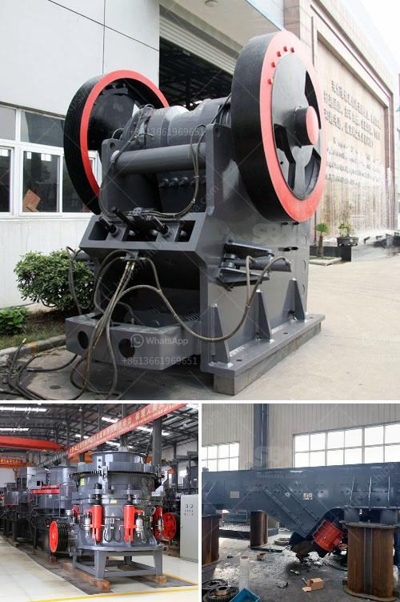

<h3>conveyor belt pricing in malaysia</h3>
Conveyor belts play a very important role in improving efficiency and automating operations in various industries. In Malaysia, it is common to find conveyor belts situated in factories, warehouses, and even supermarkets - they are used in a variety of settings for transporting goods and materials. As such, the pricing of conveyor belts in Malaysia depends on several factors, including the material used, the length and width of the belt, the type of belt, and the overall durability of the product.

One of the most important factors influencing the price of a conveyor belt is the material used to make it. Conveyor belts can be made from rubber, steel, and other materials, and each comes with its own advantages and disadvantages. Rubber is the most common material, as it is affordable, durable, and offers good resistance to wear and tear. Steel belts, on the other hand, are more expensive but are better suited for heavy-duty applications that involve high temperatures or require strong resistance to impact.

Another variable in conveyor belt pricing is the length and width of the belt. Longer belts require more materials and can be more expensive to produce. Similarly, wider belts are pricier because they require more material and also have higher production costs. However, the length and width of the belt are usually determined by the specific requirements of the industry or application, so it is necessary to strike a balance between cost and functionality.

Additionally, the type of conveyor belt can impact the pricing as well. There are several types available, such as flat belts, modular belts, cleated belts, and magnetic belts, each with its own unique features and benefits. For instance, flat belts are simple in design and ideal for moving lightweight materials, while cleated belts are suitable for incline or decline applications. The complexity of manufacturing different types of belts can affect their cost, which is reflected in the pricing.

Durability is another key consideration when pricing conveyor belts. Some industries require conveyor belts that can withstand harsh environments and heavy loads, resulting in higher manufacturing costs and subsequently higher prices. For example, conveyor belts used in the mining industry may be subjected to extreme conditions like dust, heat, and continuous heavy usage. In such cases, investing in more durable and robust belts may be necessary, even if it means a higher initial cost.

It is worth noting that pricing can also vary depending on the supplier or manufacturer. Some manufacturers may offer competitive pricing due to economies of scale or use cost-effective production methods. However, it is important not to compromise quality for a lower price, as poorly constructed or low-quality conveyor belts can result in frequent breakdowns and more significant maintenance costs.

In conclusion, the pricing of conveyor belts in Malaysia depends on various factors, including the material, length and width, type, and durability of the belt. It is crucial to consider the specific requirements of the application and strike a balance between cost and functionality. While it may be tempting to opt for the cheapest option available, investing in a high-quality conveyor belt pays off in the long run, ensuring smooth operations, increased productivity, and reduced downtime.
<h3>Contact us</h3><ul><li><strong>Whatsapp:&nbsp;<a href="https://wa.me/8613661969651">+8613661969651</a></strong></li><li><a href="https://swt.shibang-china.com/?git&amp;zhl&amp;conveyor belt pricing in malaysia"><strong>Online Service(chat now)</strong></a></li></ul><h3>Related</h3><ul><li><a href='quartz stone quarry in nigeria.md'>quartz stone quarry in nigeria</a></li><li><a href='turkey quarry machines manufacturer.md'>turkey quarry machines manufacturer</a></li><li><a href='gypsum board thailand manufacturer.md'>gypsum board thailand manufacturer</a></li><li><a href='coal mining equipment in spain.md'>coal mining equipment in spain</a></li><li><a href='stone crusher and quarry plant in galway ireland.md'>stone crusher and quarry plant in galway ireland</a></li></ul>