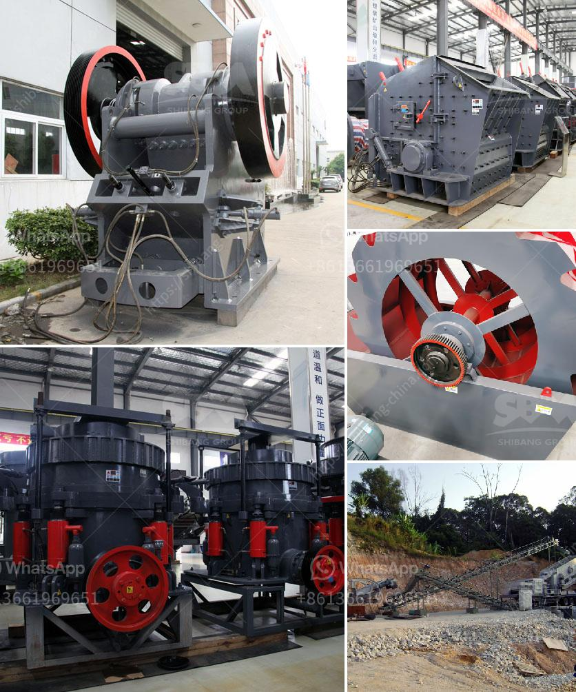

<h3>conveyor belt seller in korea</h3>
Conveyor belts have become an integral part of many industries, facilitating the smooth movement of goods and materials. In South Korea, there are numerous conveyor belt sellers that offer a wide range of options to meet the diverse needs of different industries. These sellers operate with a focus on quality, innovation, and customer satisfaction, contributing to the overall efficiency and productivity of businesses across the country.

One such conveyor belt seller in Korea is XYZ Conveyors. With over two decades of experience in the industry, XYZ Conveyors has established itself as a reliable and reputable supplier. They offer an extensive range of conveyor belt options, including rubber belts, PVC belts, and modular belts, ensuring that they can cater to various industries such as manufacturing, mining, food processing, and logistics.

Quality is paramount in the conveyor belt industry, as these belts need to withstand harsh operational conditions and carry heavy loads. XYZ Conveyors understands this and places a strong emphasis on producing durable and high-performance conveyor belts. They source their materials from reputable suppliers and employ state-of-the-art manufacturing techniques to ensure the durability and reliability of their products.

Innovation is another key aspect of the conveyor belt industry, as businesses constantly seek ways to enhance operational efficiency. XYZ Conveyors is no exception to this, continually investing in research and development to improve their product offerings. They have introduced advanced features such as anti-static properties, flame retardancy, and friction-reducing surfaces, tailored to meet specific customer requirements and industry regulations.

Moreover, XYZ Conveyors provides customized solutions based on the unique needs of their clients. They collaborate closely with businesses to analyze their operations and recommend the most suitable conveyor belt system. This personalized approach ensures that customers can maximize efficiency and productivity while minimizing downtime and maintenance costs.

Customer satisfaction remains at the core of XYZ Conveyors' business philosophy. Their team of skilled professionals provides comprehensive after-sales support, including installation assistance, maintenance services, and technical guidance. This commitment to customer support has earned them a loyal clientele and positive word-of-mouth recommendations throughout the industry.

With the increasing demand for conveyor belts in South Korea, competition among sellers is fierce. It is vital for businesses to choose a seller that not only offers quality products but also provides excellent service. XYZ Conveyors excels in both areas, making them a preferred choice for many companies seeking conveyor belt solutions.

In conclusion, the conveyor belt seller industry in South Korea plays a crucial role in improving efficiency and productivity in various sectors. XYZ Conveyors, with their focus on quality, innovation, and customer satisfaction, stands out as a leading seller. Through their wide range of reliable products, customized solutions, and comprehensive after-sales support, XYZ Conveyors continues to contribute significantly to the growth of industries in South Korea.
<h3>Contact us</h3><ul><li><strong>Whatsapp:&nbsp;<a href="https://wa.me/8613661969651">+8613661969651</a></strong></li><li><a href="https://swt.shibang-china.com/?git&amp;zhl&amp;conveyor belt seller in korea"><strong>Online Service(chat now)</strong></a></li></ul><h3>Related</h3><ul><li><a href='stone crushing plants close to rotate.md'>stone crushing plants close to rotate</a></li><li><a href='grinding milling equipment in south africa.md'>grinding milling equipment in south africa</a></li><li><a href='jaw crusher altairac.md'>jaw crusher altairac</a></li><li><a href='what is cost for putting up a 2500 tpd cement plant.md'>what is cost for putting up a 2500 tpd cement plant</a></li><li><a href='hydraulic cone crusher price.md'>hydraulic cone crusher price</a></li></ul>