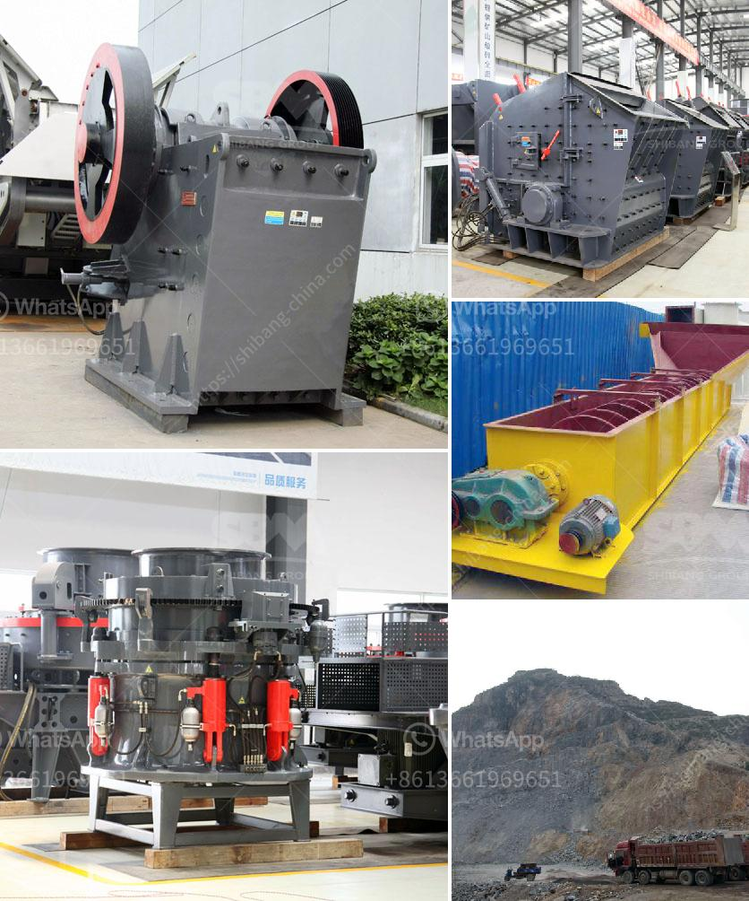

<h3>conveyor belt supplier in china</h3>
China has emerged as a leading destination for businesses looking for reliable and cost-effective conveyor belt suppliers. The country is known for its advanced manufacturing capabilities and the conveyor belt industry is no exception. With a wide range of suppliers offering various types of conveyor belts to meet diverse industrial needs, China has become a go-to destination for businesses around the world.

One of the key advantages of sourcing conveyor belts from China is the cost-effectiveness. China offers competitive prices due to its low labor costs and large-scale production capabilities. The conveyor belt suppliers leverage economies of scale to offer high-quality products at a fraction of the price compared to other countries. This cost advantage has made China a preferred choice for businesses looking to optimize their supply chain costs.

Moreover, Chinese conveyor belt suppliers are known for their adherence to strict quality control measures. Most of the suppliers are ISO certified, ensuring that their manufacturing processes meet international standards. This commitment to quality has enabled the Chinese suppliers to build a reputation for providing reliable and durable conveyor belts that can withstand even the most demanding industrial environments.

China's conveyor belt manufacturers also offer a wide range of options to cater to different industry requirements. Whether it's for mining, agriculture, food processing, or logistics, Chinese suppliers have the expertise to provide customized solutions. They offer a variety of belt materials, including rubber, PVC, and nylon, with different features such as heat resistance, oil resistance, and flame retardancy. This versatility allows businesses to find the perfect conveyor belt for their specific needs.

Another advantage of working with conveyor belt suppliers in China is the speed of production and delivery. With their advanced manufacturing infrastructure and efficient logistics networks, Chinese suppliers can quickly produce and ship conveyor belts to customers worldwide. This fast turnaround time helps businesses minimize downtime and ensure smooth operations.

In terms of sustainability, Chinese suppliers are increasingly focusing on eco-friendly practices. Many conveyor belt manufacturers in China are implementing green initiatives to reduce their environmental impact. This includes using eco-friendly materials, optimizing energy consumption, and adopting recyclable packaging. By choosing a Chinese conveyor belt supplier, businesses can contribute to their sustainability goals while meeting their operational needs.

However, it's crucial for businesses to conduct thorough research and due diligence before choosing a conveyor belt supplier in China. While the country offers a plethora of options, not all suppliers may meet the required quality standards or have the necessary certifications. It's advisable to check their track record, read customer reviews, and visit their manufacturing facilities to ensure that they can provide reliable products and services.

In conclusion, China's conveyor belt suppliers have established themselves as trusted partners for businesses around the world. Their cost-effectiveness, commitment to quality, versatility, and speedy delivery make them an attractive choice for companies seeking reliable conveyor belts. By partnering with a reputable conveyor belt supplier in China, businesses can benefit from high-quality products and optimize their supply chain operations.
<h3>Contact us</h3><ul><li><strong>Whatsapp:&nbsp;<a href="https://wa.me/8613661969651">+8613661969651</a></strong></li><li><a href="https://swt.shibang-china.com/?git&amp;zhl&amp;conveyor belt supplier in china"><strong>Online Service(chat now)</strong></a></li></ul><h3>Related</h3><ul><li><a href='second hand stone crusher sale in india.md'>second hand stone crusher sale in india</a></li><li><a href='sand manufacturing machine.md'>sand manufacturing machine</a></li><li><a href='hydraulic cone crusher price.md'>hydraulic cone crusher price</a></li><li><a href='roller crusher machine manufacturer.md'>roller crusher machine manufacturer</a></li><li><a href='sand wash plant for sale.md'>sand wash plant for sale</a></li></ul>