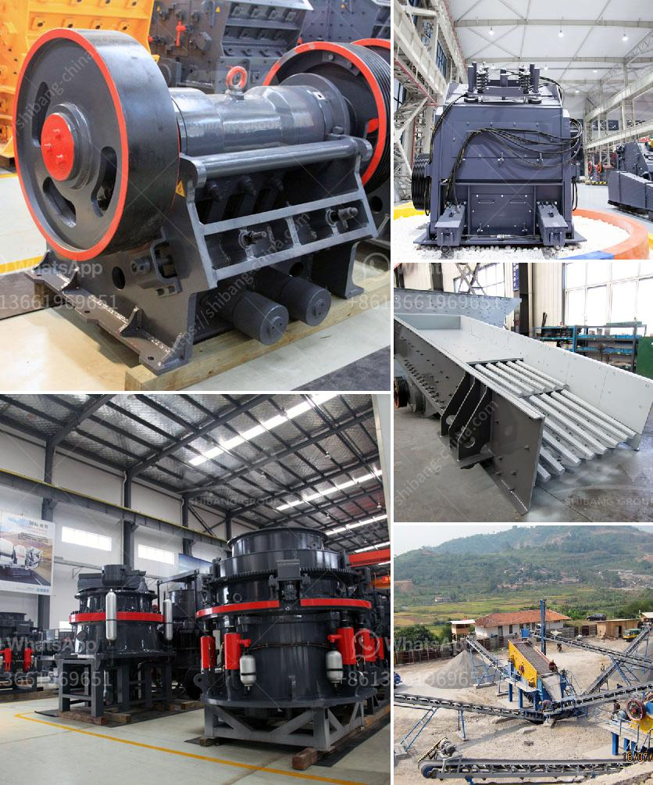

<h3>conveyor belts company</h3>
In today's fast-paced industrial world, efficient material handling is crucial for the success of any manufacturing or distribution operation. One integral component in this process is the conveyor belt. Conveyor belts play a pivotal role in transporting various materials, goods, and products from one point to another within a facility or even between different locations.

One reliable company that specializes in conveyor belts and provides comprehensive material handling solutions is Conveyor Belts Company (CBC). With a strong commitment to quality, innovation, and customer satisfaction, CBC has emerged as a leader in the industry, catering to a wide range of sectors such as mining, automotive, food processing, and logistics.

CBC offers a diverse range of conveyor belts, each designed to meet specific operational requirements. Whether it's handling heavy-duty materials or delicate goods requiring gentle transportation, CBC has the expertise to provide tailored solutions. Their product range includes belt types such as flat belts, modular belts, timing belts, and specialty belts, each offering unique features and benefits depending on the application.

One of the key factors that sets CBC apart from its competitors is its focus on innovation and technological advancements. The company continuously invests in research and development to ensure their conveyor belts are at the forefront of industry standards. This dedication to innovation has led to the incorporation of state-of-the-art features, such as self-tracking capabilities, specialized coatings for increased durability and resistance, and improved energy efficiency.

Furthermore, CBC prioritizes the sustainability aspect of their products. They recognize the importance of reducing environmental impact while still providing efficient material handling solutions. As a result, they offer eco-friendly conveyor belts made from recycled materials, utilizing renewable energy sources during the manufacturing process, and implementing recycling programs for end-of-life belts.

Another notable aspect of CBC's operations is their commitment to customer satisfaction. The company takes a consultative approach, working closely with clients to understand their unique requirements. From initial design and installation to ongoing maintenance and support, CBC ensures that their customers receive a seamless and hassle-free experience. Their team of experienced technicians is readily available to provide prompt service and assistance, minimizing downtime and maximizing productivity.

CBC's dedication to excellence has earned them a solid reputation as a trusted partner in the material handling industry. Their portfolio boasts an extensive list of satisfied clients, ranging from small businesses to multinational corporations. Clients value their commitment to quality, reliability, and on-time delivery.

In conclusion, Conveyor Belts Company is a leading provider of conveyor belts and material handling solutions. With a wide range of products, a focus on innovation, and a dedication to customer satisfaction, they have established themselves as a reliable and trusted partner in the industry. As the demand for efficient material handling continues to rise, CBC remains at the forefront, providing seamless and reliable solutions to meet the evolving needs of various sectors.
<h3>Contact us</h3><ul><li><strong>Whatsapp:&nbsp;<a href="https://wa.me/8613661969651">+8613661969651</a></strong></li><li><a href="https://swt.shibang-china.com/?git&amp;zhl&amp;conveyor belts company"><strong>Online Service(chat now)</strong></a></li></ul><h3>Related</h3><ul><li><a href='pulverizer crusher manufacturer in chennai.md'>pulverizer crusher manufacturer in chennai</a></li><li><a href='gold stamp mills in zimbabwe.md'>gold stamp mills in zimbabwe</a></li><li><a href='impact crushers for sale.md'>impact crushers for sale</a></li><li><a href='copper crusher for sale in malaysia.md'>copper crusher for sale in malaysia</a></li><li><a href='crusher manufacturers in saudi.md'>crusher manufacturers in saudi</a></li></ul>