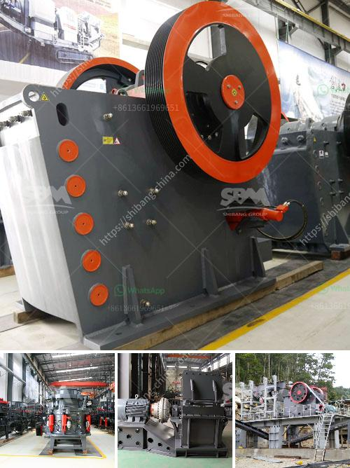

<h3>conveyor belts for material</h3>
Conveyor belts have become an essential part of various industries, enabling the efficient transportation of materials from one point to another. Whether it's in factories, warehouses, airports, or even mines, conveyor belts have revolutionized the way we handle and transport goods.

One of the primary advantages of conveyor belts is their ability to move materials effortlessly and continuously. Unlike manual labor or forklifts, conveyor belts can carry large quantities of materials, saving time and effort. This results in increased productivity by streamlining the production process.

Conveyor belts are designed to handle a wide range of materials, including but not limited to commodities such as grains, coal, sand, and minerals. They are also used for transporting heavy objects like cars and machinery. The belts are made from durable materials such as rubber or PVC, ensuring their longevity even under harsh conditions.

Another advantage of conveyor belts is their ability to operate efficiently in any environment. Whether it's extreme weather conditions like heat or cold, or in highly corrosive environments, conveyor belts can withstand it all. This versatility makes them suitable for various industries, from agriculture to mining.

Furthermore, conveyor belts are adjustable, allowing the transportation of materials in different directions, inclinations, and speeds. This adjustability enhances the flexibility of conveyor systems, making them adaptable to the unique requirements of each industry. Whether you need to transport materials vertically, horizontally or at an incline, there is a conveyor belt system that can meet your needs.

In conclusion, conveyor belts have revolutionized the material handling industry. With their ability to transport materials efficiently, withstand harsh environments, and adapt to various requirements, they have become an indispensable component of modern industrial processes. As technology advances, we can expect conveyor belts to continue evolving, providing even more efficient and effective solutions for material transportation.
<h3>Contact us</h3><ul><li><strong>Whatsapp:&nbsp;<a href="https://wa.me/8613661969651">+8613661969651</a></strong></li><li><a href="https://swt.shibang-china.com/?git&amp;zhl&amp;conveyor belts for material"><strong>Online Service(chat now)</strong></a></li></ul><h3>Related</h3><ul><li><a href='barmac crushers for sale.md'>barmac crushers for sale</a></li><li><a href='rock cutting and grinding machine price.md'>rock cutting and grinding machine price</a></li><li><a href='types of ball mills.md'>types of ball mills</a></li><li><a href='bauxite crusher equipment.md'>bauxite crusher equipment</a></li><li><a href='conveyor belt pricing in malaysia.md'>conveyor belt pricing in malaysia</a></li></ul>