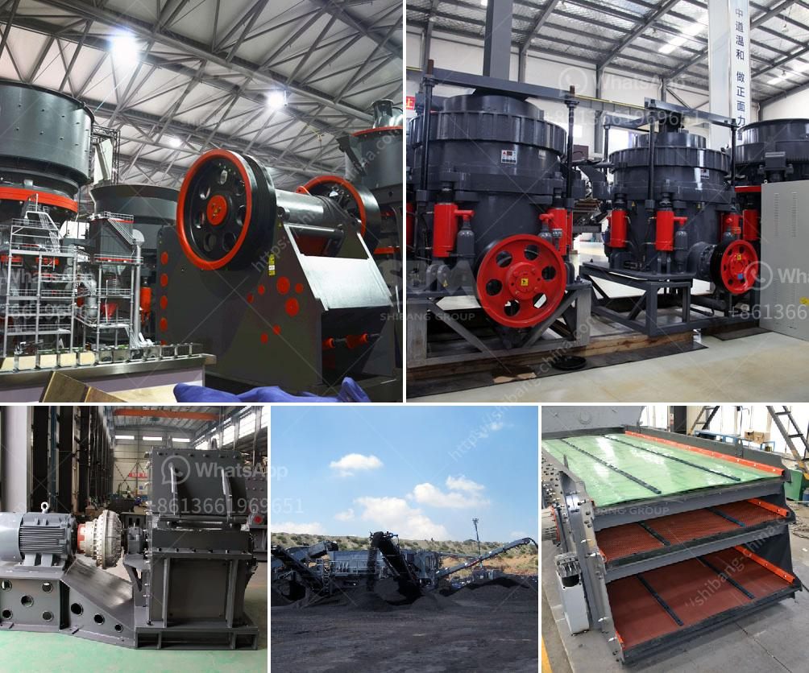

<h3>conveyor for sale in malaysia</h3>
Conveyors play a crucial role in various industries, enabling efficient movement of materials or products from one point to another. In recent years, Malaysia has witnessed a significant surge in the demand for conveyors, as companies continuously strive to streamline their operations and enhance productivity. 

Conveyor systems offer numerous benefits, making them an indispensable tool in industries such as manufacturing, warehousing, and logistics. One of the primary advantages is the ability to automate the handling of goods, reducing the reliance on manual labor. By eliminating the need for manual transportation, conveyors save time and effort, allowing employees to focus on higher-value tasks. 

Another advantage of using conveyors is the improvement in process efficiency. With the ability to transport goods at a consistent speed and eliminate human errors, conveyor systems minimize the risk of material damage and ensure a smooth workflow. This leads to increased productivity and reduced downtime, ultimately resulting in cost savings for businesses. 

Furthermore, conveyors are highly customizable to suit specific industry requirements. Whether it's a simple roller conveyor or a complex automated system, manufacturers offer a wide range of options to cater to various needs. From inclined and decline conveyors to belt and chain conveyors, companies can choose the most suitable type based on factors such as product weight, size, and the desired speed of transport. 

In Malaysia, there are numerous suppliers and distributors that offer conveyors for sale. These suppliers provide a comprehensive range of conveyor systems, including both standard and customized solutions. They work closely with clients to assess their needs and offer expert advice on selecting the most suitable conveyor system for their operations. Moreover, suppliers in Malaysia often provide installation, repair, and maintenance services to ensure optimal performance and longevity of the conveyor systems. 

With the ever-increasing demand for efficiency and productivity across industries in Malaysia, the availability of conveyor systems for sale provides a reliable solution to enhance operations. As companies strive to stay competitive in a fast-paced business environment, investing in a conveyor system has become a necessity in the quest for streamlined processes and improved productivity.
<h3>Contact us</h3><ul><li><strong>Whatsapp:&nbsp;<a href="https://wa.me/8613661969651">+8613661969651</a></strong></li><li><a href="https://swt.shibang-china.com/?git&amp;zhl&amp;conveyor for sale in malaysia"><strong>Online Service(chat now)</strong></a></li></ul><h3>Related</h3><ul><li><a href='size of balls in ball mill.md'>size of balls in ball mill</a></li><li><a href='model of crusher and steps of constructions.md'>model of crusher and steps of constructions</a></li><li><a href='barite mill saltillo.md'>barite mill saltillo</a></li><li><a href='production of cement in guinee.md'>production of cement in guinee</a></li><li><a href='jaw crusher plant in saudi.md'>jaw crusher plant in saudi</a></li></ul>