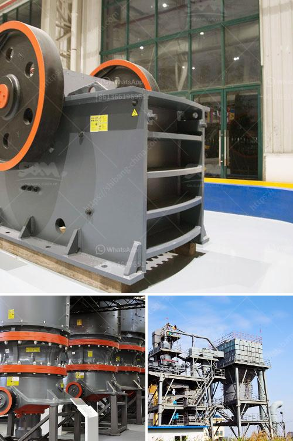

<h3>copper concentrate mobile crusher</h3>
Copper concentrate mobile crusher is one of the most commonly used mining equipment, which is widely used in many industries such as mining, metallurgy, construction material, highway, railway, water conservancy and chemical industry. With the continuous development of mining technology, mobile crusher has effectively escaped the bondage of traditional mining equipment and realized the modernization of mining industry equipment, which greatly improves the efficiency and expands the scope of mining operation.

Firstly, the copper concentrate mobile crusher is made of various metal and non-metallic components, which are wear-resistant and durable. It can withstand the harsh working environment and has a long service life. Secondly, the mobile crusher has a compact structure, and the entire machine is small and exquisite, which is convenient for installation and maintenance. It reduces the transportation cost and floor space, and expands the application range of the equipment.

Thirdly, the copper concentrate mobile crusher adopts full process crushing, tertiary crushing and washing process, which is clean, environmentally friendly and less dust. It can crush large copper ore into specified size in one time, ensuring the production efficiency is high and the finished product size is uniform.

Fourthly, the copper concentrate mobile crusher is easy to operate, can be used by single machine or combined by multiple machines, which greatly expands the flexibility of the equipment and meets the various mining requirements. It can be equipped with different crushing equipment according to the specific material properties and final product requirements, such as jaw crusher, impact crusher, cone crusher, etc.

Fifthly, the copper concentrate mobile crusher has intelligent operation system, with advanced remote monitoring, real-time adjustment and control of various parameters, which effectively ensures the safe and stable operation of the equipment. It can achieve high efficiency and low energy consumption, and effectively reduce production costs.

In conclusion, the copper concentrate mobile crusher is a high-efficiency crushing equipment, which can be used in various mining fields and has made outstanding achievements in resource recycling. As a mature mining equipment, it can be used in a combination mode, flexibly meeting various production needs. With the continuous advancement of technology, the copper concentrate mobile crusher will usher in a broader development prospect, promoting the progress of the mining industry.
<h3>Contact us</h3><ul><li><strong>Whatsapp:&nbsp;<a href="https://wa.me/8613661969651">+8613661969651</a></strong></li><li><a href="https://swt.shibang-china.com/?git&amp;zhl&amp;copper concentrate mobile crusher"><strong>Online Service(chat now)</strong></a></li></ul><h3>Related</h3><ul><li><a href='top stone crusher companies in india.md'>top stone crusher companies in india</a></li><li><a href='stone crusher rent based mobile machine.md'>stone crusher rent based mobile machine</a></li><li><a href='ball mill ball feeders.md'>ball mill ball feeders</a></li><li><a href='portable mobile crusher for sale.md'>portable mobile crusher for sale</a></li><li><a href='iron crushing machine.md'>iron crushing machine</a></li></ul>