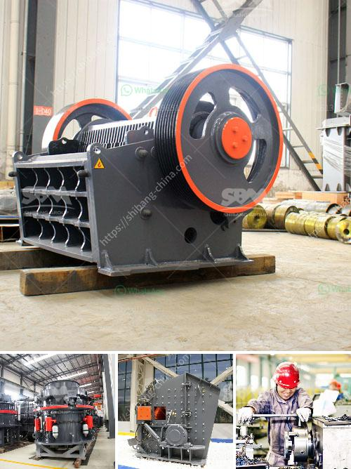

<h3>copper crusher for sale in malaysia</h3>
Copper is an essential mineral that is widely used in various industries. As a conductor of electricity and heat, copper is crucial for electrical wiring, plumbing, and electronics. With its excellent properties and versatility, it is no wonder that copper is in high demand worldwide.

In Malaysia, copper is highly sought after by industries and individuals alike. Whether for industrial purposes or personal use, copper products are widely used and valued. One of the most common copper products that Malaysians look for is the copper crusher.

Copper crusher, also known as copper ore crusher, is used for crushing mine ore into small particle size for copper concentrate process. In the copper ore mining plant, copper crusher is the essential crushing machine used for crushing copper ore into small particles. Some of our esteemed customers in Malaysia are interested in our copper crusher for sale.

1. Jaw crusher: It is the primary crushing machine used in copper ore crushing plant. It is an important mining equipment used in the mining and construction industry.

2. Impact crusher: This crusher is used for secondary crushing. It is suitable for crushing all kinds of materials with compressive strength less than 320 MPa.

3. Cone crusher: This crusher is used for processing copper ore into finer particles. It can crush copper stones into smaller sizes. Therefore, it is commonly used as the secondary crusher after jaw crusher.

4. VSI crusher: This crusher is the most advanced impact crusher in modern world, and it introduces high quality roller bearing like Sweden SKF or American TIMKEN, which ensure the smooth running of the main unit.

In addition, there are various models and specifications of copper crushers available for sale in Malaysia. The following are some popular copper crushers recommended by our experts:

1. PE Series High Quality Jaw Crusher: This crusher has large capacity and high crushing efficiency. It is suitable for primary crushing.

2. PF Series Impact Crusher: This crusher has excellent crushing chamber and rotor design. It has been proven to be reliable and efficient in mining applications.

3. HPC Series Hydraulic Cone Crusher: This crusher is equipped with hydraulic system, which makes it convenient to adjust the discharge opening and protect the crusher from iron overload.

4. VSI Series Vertical Shaft Impact Crusher: This crusher is suitable for processing medium-hard and soft ores. It has been widely used in various mining and construction applications.

In conclusion, the sale of copper crusher in Malaysia is a hot topic in the mining and construction industry. Copper is an essential mineral used in various industries, and copper crushers are widely used to process copper ores into smaller particles for further use. With various models and specifications available, customers in Malaysia have a wide range of options to choose from when purchasing a copper crusher. Whether for industrial purposes or personal use, a reliable and efficient copper crusher is essential for copper mining and processing activities.
<h3>Contact us</h3><ul><li><strong>Whatsapp:&nbsp;<a href="https://wa.me/8613661969651">+8613661969651</a></strong></li><li><a href="https://swt.shibang-china.com/?git&amp;zhl&amp;copper crusher for sale in malaysia"><strong>Online Service(chat now)</strong></a></li></ul><h3>Related</h3><ul><li><a href='jaw crusher vs gyratory crusher stone crusher quarry.md'>jaw crusher vs gyratory crusher stone crusher quarry</a></li><li><a href='but concrete crushers nigeria.md'>but concrete crushers nigeria</a></li><li><a href='grinding crushing mill brick.md'>grinding crushing mill brick</a></li><li><a href='pakistan directory of cement plants list pdf.md'>pakistan directory of cement plants list pdf</a></li><li><a href='mobile stone crusher for sale in south africa.md'>mobile stone crusher for sale in south africa</a></li></ul>