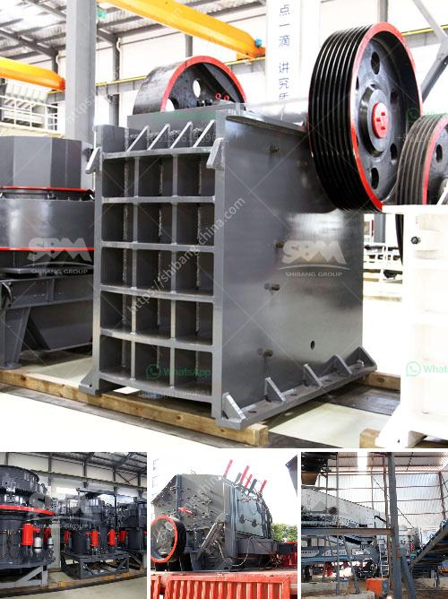

<h3>copper ore conveying system</h3>
Mining operations are critical to the global economy, as they provide essential materials for various industries. Copper ore, one of the most widely used metals, is found in mines around the world. Extracting this precious resource efficiently requires robust infrastructure, and a crucial component of this infrastructure is the copper ore conveying system.

A copper ore conveying system is designed to transport copper ore from an open-pit mine to the processing plant, where it can be refined further. This system consists of various equipment, including crushers, belt conveyors, vibrating screens, storage facilities, and more. It plays a vital role in streamlining and optimizing mining operations.

Efficiency is key in mining operations, and a well-designed copper ore conveying system can significantly enhance productivity. By automating the transportation of ore, it reduces manual labor and increases production output. The system ensures a constant flow of ore, eliminating downtime caused by blockages or bottlenecks.

One of the critical elements of a copper ore conveying system is the belt conveyor. These conveyors are typically long and made of durable materials capable of withstanding the harsh conditions of mining environments. Equipped with robust motors and a well-designed structure, they are capable of handling heavy loads and transporting ore efficiently over long distances.

Another vital component is the crushers, which crush the mined ore into smaller pieces, making it easier to transport. Vibrating screens help in screening the ore to separate it into different sizes, ensuring only the desired material continues through the conveying system.

Storage facilities are also an essential part of a copper ore conveying system. These facilities provide temporary storage for ore before it is transported to the processing plant. Proper storage facilities help maintain a consistent flow of ore, allowing for a continuous and uninterrupted production process.

In conclusion, a reliable and well-designed copper ore conveying system is crucial for efficient mining operations. It optimizes productivity, minimizes downtime, and ensures a continuous flow of ore from the mine to the processing plant. By streamlining the transportation process, this system plays a vital role in meeting the global demand for copper and supporting various industries that rely on this versatile metal.
<h3>Contact us</h3><ul><li><strong>Whatsapp:&nbsp;<a href="https://wa.me/8613661969651">+8613661969651</a></strong></li><li><a href="https://swt.shibang-china.com/?git&amp;zhl&amp;copper ore conveying system"><strong>Online Service(chat now)</strong></a></li></ul><h3>Related</h3><ul><li><a href='crusher machine china.md'>crusher machine china</a></li><li><a href='china vibrating screen.md'>china vibrating screen</a></li><li><a href='difference between sand and crushed stone powder.md'>difference between sand and crushed stone powder</a></li><li><a href='hard rock crusher.md'>hard rock crusher</a></li><li><a href='cost of granite crushing equipment.md'>cost of granite crushing equipment</a></li></ul>