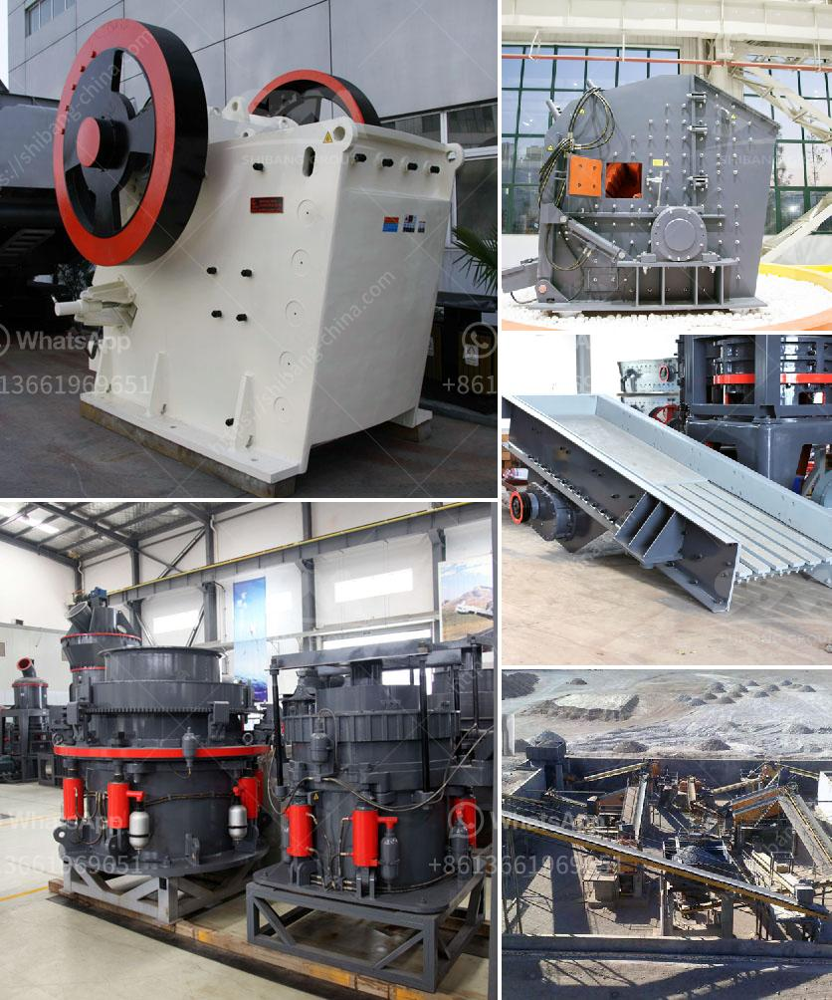

<h3>copper ore crushing machinery</h3>
Copper ore is mined from copper veins and it is typically processed into copper concentrate or copper ore sand with high copper content. Copper ore can be divided into three categories: copper sulfide ore, copper oxide ore, and natural copper. Copper ore crushing machinery is used for crushing copper ore to a smaller size for further processing.

Copper ore crushing machinery includes jaw crusher, impact crusher, cone crusher, hammer crusher and mobile crusher, etc. These different types of crushers can be used for different purposes in the process of copper ore crushing. In addition, some of the machines have the capability to crush other ores besides copper ore.

Jaw crusher is a commonly used coarse crushing equipment. It can be used in both primary and secondary crushing processes, with a crushing ratio of 4-6. It is particularly suitable for crushing large and hard materials.

Impact crusher is a commonly used medium and fine crushing equipment, suitable for crushing various ores and rocks with compressive strength less than 350MPa. It is widely used in metallurgy, mining, cement, chemical industry, refractory materials and ceramics, etc.

Cone crusher is a high-efficiency crushing equipment suitable for crushing all kinds of ores and rocks with medium or higher hardness. It has the advantages of large crushing ratio, high efficiency, low energy consumption, uniform product size, and is suitable for crushing and fine crushing of various ores and rocks.

Hammer crusher is suitable for crushing all kinds of brittle materials, such as coal gangue, coal, coke, red sandstone, iron ore, etc. It has the characteristics of large crushing ratio, high production capacity, uniform product size, simple structure, reliable operation, and easy maintenance.

Mobile crusher is a new type of crushing equipment, which is widely used in mine ore crushing, construction waste recycling, construction aggregate production, highway, railway, bridge construction and other industries. It can process various ores and rocks with a compressive strength not exceeding 320MPa.

In conclusion, copper ore crushing machinery plays an important role in the copper ore processing plant. It helps to crush and grind copper ores into desired size for further beneficiation process. Depending on the different types of copper ore, different models of crushing machines are needed.
<h3>Contact us</h3><ul><li><strong>Whatsapp:&nbsp;<a href="https://wa.me/8613661969651">+8613661969651</a></strong></li><li><a href="https://swt.shibang-china.com/?git&amp;zhl&amp;copper ore crushing machinery"><strong>Online Service(chat now)</strong></a></li></ul><h3>Related</h3><ul><li><a href='gold milling plant in zimbabwe.md'>gold milling plant in zimbabwe</a></li><li><a href='stone crusher plant in uae.md'>stone crusher plant in uae</a></li><li><a href='sample quarry business plan.md'>sample quarry business plan</a></li><li><a href='prices for stone crusher plant.md'>prices for stone crusher plant</a></li><li><a href='pe series jaw crusher rate 1000ton per hour.md'>pe series jaw crusher rate 1000ton per hour</a></li></ul>