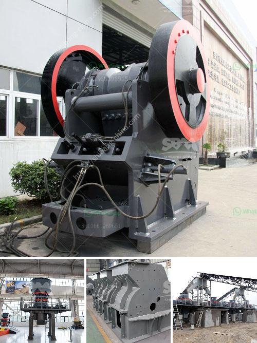

<h3>copper ore refinement processors philippines</h3>
The Philippines is blessed with abundant mineral resources, and one of its notable resources is copper ore. With large deposits found all over the archipelago, the country continues to be one of the world's top copper producers. But beyond extraction, copper ore refinement processors play a crucial role in the local economy by transforming raw copper ore into usable materials.

Copper ore refinement processors in the Philippines are at the forefront of creating value-added products from this precious metal. Through a series of complex processes, copper ore is purified and transformed into various forms, including copper concentrate, cathodes, wires, and alloys. These refined materials are then utilized in a wide array of applications, from electrical wiring and electronics to construction and automotive industries.

Apart from adding value, copper ore refinement processors contribute significantly to the local economy. The industry provides employment opportunities for thousands of Filipinos, especially in regions where copper mining operations are concentrated. This not only helps in reducing unemployment rates but also boosts the socio-economic conditions in these areas, creating better livelihoods for the local communities.

Additionally, the presence of copper ore refinement processors supports local businesses and suppliers. These processors often require various inputs, such as chemicals, equipment, and services, which are sourced locally. By partnering with local suppliers, they stimulate economic growth and development, assisting in the overall promotion of a sustainable and inclusive business ecosystem.

Moreover, copper ore refinement processors in the Philippines play a critical role in the advancement of the country's mining sector. Their expertise in refining copper ore helps in improving management and operational practices within the industry. This is essential in ensuring environmental sustainability, safety standards, and social responsibility in mining activities.

Overall, copper ore refinement processors in the Philippines play a significant role in adding value to the country's natural resources and growing the local economy. Their contribution goes beyond transforming raw materials into refined products; they create employment, support local businesses, and contribute to the advancement of the mining sector. As the demand for copper and its refined products continues to rise globally, the Philippines is well-positioned to harness this opportunity and further enhance its standing in the copper industry.
<h3>Contact us</h3><ul><li><strong>Whatsapp:&nbsp;<a href="https://wa.me/8613661969651">+8613661969651</a></strong></li><li><a href="https://swt.shibang-china.com/?git&amp;zhl&amp;copper ore refinement processors philippines"><strong>Online Service(chat now)</strong></a></li></ul><h3>Related</h3><ul><li><a href='shell powder making machine grinding mill for sale.md'>shell powder making machine grinding mill for sale</a></li><li><a href='gold ore rock processing equipment price.md'>gold ore rock processing equipment price</a></li><li><a href='grinder rock crusher.md'>grinder rock crusher</a></li><li><a href='iron crushing plant.md'>iron crushing plant</a></li><li><a href='mobile mineral processing gravity plants.md'>mobile mineral processing gravity plants</a></li></ul>