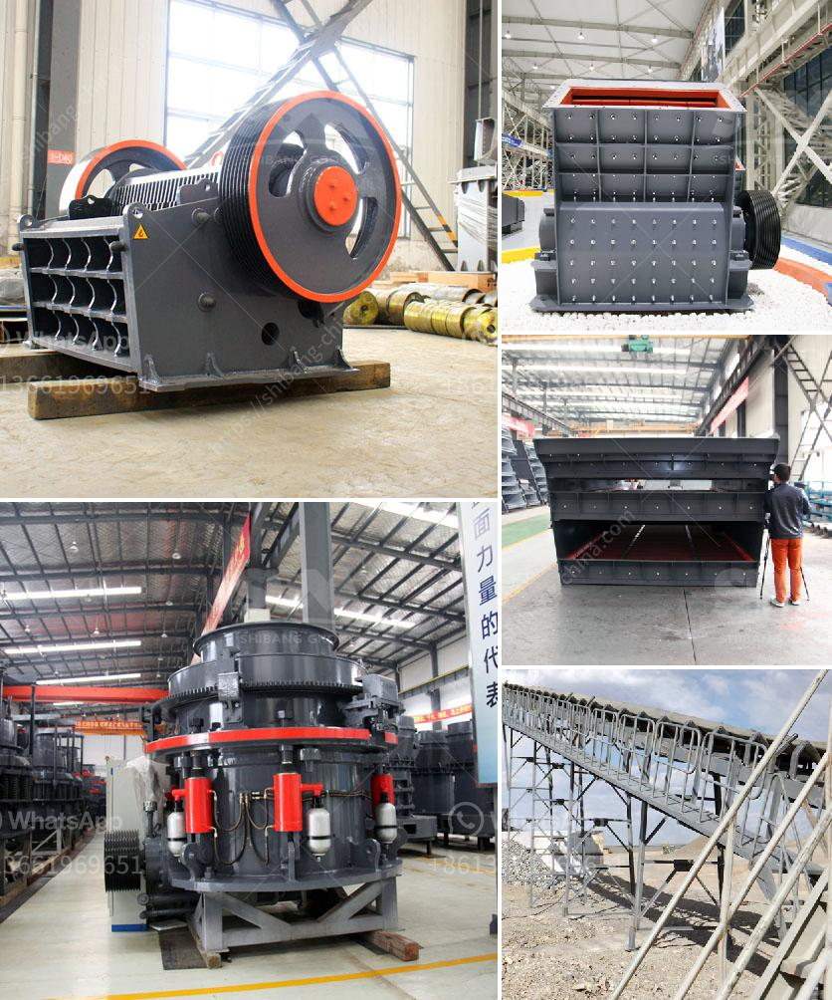

<h3>copper slag manufacturing process</h3>
Copper slag is a by-product of the copper metal extraction process. The manufacturing of copper usually involves a mixture of copper ore, flux, and various additives. Copper slag is a waste material obtained during the smelting and refining of copper. It is a black, glassy granular material that is primarily used in construction and abrasive industries.

The manufacturing process of copper slag involves several steps. Firstly, the raw materials, including copper ore and flux, are crushed and ground to reduce their size. The crushed materials are then mixed and roasted in a furnace at a high temperature. The roasting process helps in removing impurities and converting the copper ore into copper matte.

After roasting, the copper matte is then smelted to obtain blister copper. Smelting involves heating the copper matte with additional flux and other additives in a furnace. The smelting temperature is typically around 1200 to 1300 degrees Celsius. During smelting, the impurities in the copper matte are separated from the copper metal.

Once the smelting process is complete, the blister copper is further refined to remove any remaining impurities. This refining process includes several stages, such as converting, electrorefining, and fire refining. Each stage helps in purifying the copper metal and obtaining high-quality copper.

During the refining process, a certain proportion of the copper slag is generated as a waste material. This slag contains valuable elements such as iron, zinc, and copper that can be recovered and reused. The manufacturing process of copper slag involves the separation and recovery of these valuable elements from the waste material.

One of the methods used for manufacturing copper slag is the flotation process. In this process, the crushed and ground copper slag is mixed with water and flotation chemicals. Air is then bubbled through the mixture to create a froth that floats on the surface. The valuable elements in the slag attach to the froth and are collected, while the unwanted material sinks to the bottom. The collected froth is then dried and smelted to obtain the desired metal.

Another method used for manufacturing copper slag is the granulation process. This process involves rapidly cooling the liquid slag in water or air to form glassy granules. The granulated slag has a lower density and is easier to handle and transport. It is commonly used in the construction industry as a replacement for natural aggregates in concrete.

In conclusion, copper slag is a by-product of the copper manufacturing process. It is generated during the smelting and refining of copper metal. The manufacturing process of copper slag involves crushing, roasting, smelting, and refining of copper ore. The waste material is then separated, and valuable elements are recovered using methods such as flotation and granulation. Copper slag is widely used in construction and abrasive industries due to its physical and chemical properties.
<h3>Contact us</h3><ul><li><strong>Whatsapp:&nbsp;<a href="https://wa.me/8613661969651">+8613661969651</a></strong></li><li><a href="https://swt.shibang-china.com/?git&amp;zhl&amp;copper slag manufacturing process"><strong>Online Service(chat now)</strong></a></li></ul><h3>Related</h3><ul><li><a href='300tpd cement plant price.md'>300tpd cement plant price</a></li><li><a href='3 roller raymond mill india.md'>3 roller raymond mill india</a></li><li><a href='china shanghai zenith company.md'>china shanghai zenith company</a></li><li><a href='ceramic crushing production line.md'>ceramic crushing production line</a></li><li><a href='second hand stone crusher sale in india.md'>second hand stone crusher sale in india</a></li></ul>