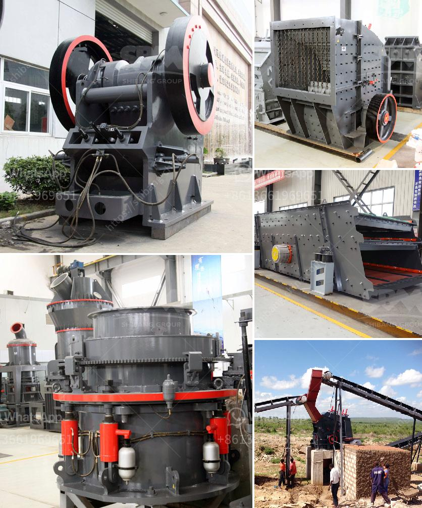

<h3>cost cone crusher</h3>
The cone crusher is a crushing machine that is commonly used in mining, metallurgical, construction, chemical and other industries. It can be used to crush hard and medium hard minerals, rocks, iron ores, limestone, copper ores, quartz, granite, sandstones, etc. In a whole production line, usually, the cone crusher is used for secondary or tertiary crushing process, or first crushing.

When it comes to the cost of cone crusher, it is important to consider the various factors that influence the price of the equipment. In this article, we will analyze some main factors that affect the cost of cone crusher.

Different brands and models of cone crushers have different specifications, performance, and prices. Therefore, when selecting the machine, it is necessary to compare and consider various factors such as production capacity, power consumption, crushing efficiency, maintenance cost, etc.

The production capacity of the cone crusher refers to the number of materials that can be crushed per unit time. Different manufacturers have different production capacity standards, so it is important to choose a suitable machine according to the actual production needs. Generally, machines with higher production capacity tend to have higher prices.

The quality of the cone crusher directly affects its performance and service life. High-quality machines are usually more expensive, but they have longer service life, lower maintenance and operating costs, and can bring greater benefits. On the contrary, low-quality machines may save costs initially, but they are prone to failures and require frequent maintenance and repair, which will increase the overall costs in the long run.

Cone crushers require regular maintenance and replacement of spare parts. The availability and prices of spare parts can significantly influence the overall cost of the machine. Before purchasing a cone crusher, it is recommended to inquire about the availability and costs of spare parts to ensure that they can be easily obtained when needed.

Market conditions also affect the cost of cone crusher to some extent. When the market demand is high and the supply is limited, the price of cone crushers tends to be higher. On the other hand, when the demand is low and there is a surplus in the market, the prices may be lower. Therefore, it is important to conduct market research and analysis to understand the current market conditions and make appropriate purchasing decisions.

In conclusion, the cost of a cone crusher is influenced by various factors such as brand, model, production capacity, equipment quality, spare parts availability, and market conditions. It is important to consider these factors carefully and make a wise investment decision. By choosing a high-quality and suitable cone crusher, users can maximize their production capacity, reduce maintenance and operating costs, and ultimately achieve higher profitability.
<h3>Contact us</h3><ul><li><strong>Whatsapp:&nbsp;<a href="https://wa.me/8613661969651">+8613661969651</a></strong></li><li><a href="https://swt.shibang-china.com/?git&amp;zhl&amp;cost cone crusher"><strong>Online Service(chat now)</strong></a></li></ul><h3>Related</h3><ul><li><a href='rock crushing plant mobile.md'>rock crushing plant mobile</a></li><li><a href='cost of setting up a mini cement plant in india.md'>cost of setting up a mini cement plant in india</a></li><li><a href='aggregate crusher plants.md'>aggregate crusher plants</a></li><li><a href='small scale stone crusher price list.md'>small scale stone crusher price list</a></li><li><a href='sand conveyors for rent.md'>sand conveyors for rent</a></li></ul>