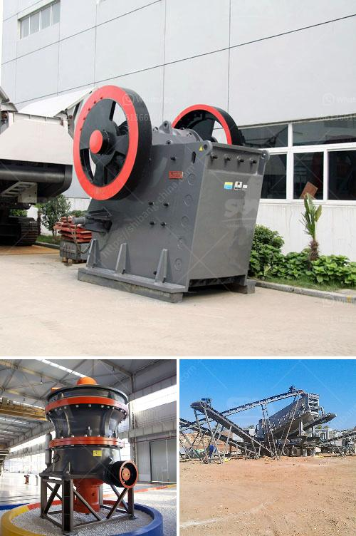

<h3>cost of a stone crusher</h3>
Stone crusher is a machine designed to reduce large rocks into smaller rocks, gravel, sand, or rock dust. Below are some of the main categories of stone crushers in the market.

Trio CT series jaw crushers are robust machines. Their rugged construction, combined with innovative features, make the Trio CT series jaw crushers the clear choice for primary applications.

Trio APS series horizontal impact crushers offer large reduction ratios and a high production capacity, without compromising the quality of its cubical product. Trio APS series crushers feature a large unobstructed opening for slabby feed due to its rear impact bars.

Cost of a stone crusher machine is a crucial factor in the industry today. Most customers are worried about the cost of a stone crusher machine as they should. Learn More

Productivity: A stone crusher plant works in one stage and in several stages. It needs different kinds of crushers to meet the different needs.

In addition, this stone crusher machine has a high degree of automation. Not only do these stone crusher machines for sale work smoothly, but also can be used to do multiple tasks at the same time. Moreover, the price of stone crushing equipment is negotiable. In addition to the above factors, the price of stone crushing equipment is also affected by the following factors: The brand effect.

Many customers tend to work with big brands because of the quality assurance and after-sales service. The failure to meet the startup requirements for a small stone processing machinery often leads to difficulties in connecting the equipment and cannot be turned on, which leads to a delay in production. Therefore, it is best to choose a manufacturer with a good reputation and after-sales service when purchasing a stone crusher machine.

In developed countries, 80%-90% of manufactured sand and aggregate is produced by crushing igneous rock (volcanic, intrusive igneous rock) or metamorphic rock (quartzite, gneiss, etc.). Deposits near the earth's surface in a favorable location attract a significant number of quarrying operations. After the crusher is selected, continuous feeding is another important way to improve the efficiency. Reasonable feeding and sufficient feeder capacity are crucial to the overall operation. Insufficient capacity may lead to uneven wear of the crusher, uneven feeding material, and excessive blockage, thus further reducing the production capacity.

Buying a stone crusher plant can be expensive. However, the initial investment can be around several million dollars, depending on the quality of the machine. The final product quality can also influence the cost of the machine.

So, it's best to do thorough research before buying a stone crusher plant. There are many manufacturers in the market, each offering different stone crusher plant prices. So, it is important to choose based on your budget and needs.

It's always a good idea to compare multiple offers and get price quotes from different suppliers before making a final decision. It's also recommended to read customer reviews and check the reputation of the manufacturer.

In summary, the cost of a stone crusher machine depends on your budget and the specific requirements of the machine. If you want the best price, you can trust Aimix Group. We offer a wide selection of stone crushers and provide comprehensive service support to meet your needs. Contact us today for detailed information and a customized quote.
<h3>Contact us</h3><ul><li><strong>Whatsapp:&nbsp;<a href="https://wa.me/8613661969651">+8613661969651</a></strong></li><li><a href="https://swt.shibang-china.com/?git&amp;zhl&amp;cost of a stone crusher"><strong>Online Service(chat now)</strong></a></li></ul><h3>Related</h3><ul><li><a href='stone crushing plant electro plants.md'>stone crushing plant electro plants</a></li><li><a href='mineral cribado cantera planta trituradora.md'>mineral cribado cantera planta trituradora</a></li><li><a href='principle of jaw crusher operation.md'>principle of jaw crusher operation</a></li><li><a href='stone crusher plant project report pdf.md'>stone crusher plant project report pdf</a></li><li><a href='used sweco screening equipment for sale.md'>used sweco screening equipment for sale</a></li></ul>