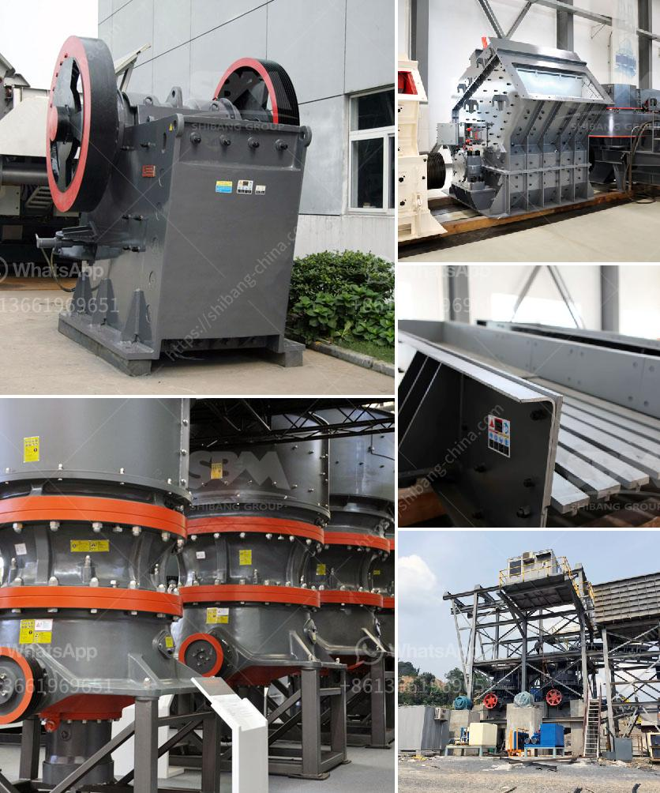

<h3>cost of an industrial mill</h3>
Industrial mills are instrumental in various sectors such as manufacturing, mining, food processing, and construction. These heavy-duty machines are designed to crush, grind, or pulverize materials into smaller particles or powders. When considering the purchase of an industrial mill, cost becomes a significant factor. In this article, we will explore the factors that influence the cost of an industrial mill and the potential benefits it can provide.

One of the primary determinants of the cost of an industrial mill is its size and capacity. Mills can vary in size from small tabletop models to massive machines that require substantial floor space. The capacity of the mill, measured in terms of how much material it can process within a given time, can also greatly impact its cost. Larger mills with higher capacities often come at a higher price due to their increased material-handling capabilities.

The type and complexity of the mill also influence its cost. There are various types of industrial mills available, such as ball mills, hammer mills, roller mills, and impact mills, each suitable for different applications and materials. Moreover, the level of automation and control systems integrated into the mill can further increase its price. Highly sophisticated mills equipped with advanced technology and automation often come with a higher price tag but offer improved efficiency and productivity.

Another crucial factor impacting the cost of an industrial mill is its construction and manufacturing materials. The materials used in the construction of the mill, including the grinding components, frames, and drives, can significantly affect the overall cost. Mills designed for heavy-duty applications are typically built with robust materials such as hardened steel or alloy. These materials not only enhance the mill's durability but also contribute to its cost.

Furthermore, the source of the mill and its manufacturer can also affect its price. Established and reputable manufacturers often command higher prices due to the quality assurance, reliability, and customer support they provide. While choosing a more affordable option from a lesser-known manufacturer might seem appealing at first, it may result in poor performance, inadequate warranty coverage, and costly maintenance or repairs down the line.

Despite the initial investment, an industrial mill can offer several benefits, making it a worthwhile expense for many businesses. The primary advantage is increased efficiency and productivity. Industrial mills allow for faster processing of materials, enabling higher production rates and reducing labor costs. They can also ensure consistent particle size distribution and quality, which is crucial in various industries like pharmaceuticals and food processing.

Moreover, industrial mills can help reduce waste and facilitate the recycling or repurposing of materials. By pulverizing or grinding materials into fine particles, mills can transform waste or byproducts into usable materials, reducing disposal costs and promoting sustainability.

In conclusion, the cost of an industrial mill is influenced by multiple factors such as its size, capacity, type, construction materials, and manufacturer. While the initial investment may seem substantial, industrial mills offer significant advantages like improved efficiency, productivity, and waste reduction. Therefore, businesses should carefully evaluate their specific requirements and consider long-term benefits when deciding to invest in an industrial mill.
<h3>Contact us</h3><ul><li><strong>Whatsapp:&nbsp;<a href="https://wa.me/8613661969651">+8613661969651</a></strong></li><li><a href="https://swt.shibang-china.com/?git&amp;zhl&amp;cost of an industrial mill"><strong>Online Service(chat now)</strong></a></li></ul><h3>Related</h3><ul><li><a href='chrome processing and drying.md'>chrome processing and drying</a></li><li><a href='iron ore mines equipments.md'>iron ore mines equipments</a></li><li><a href='biering roller mill.md'>biering roller mill</a></li><li><a href='project feasibility report on stone crusher.md'>project feasibility report on stone crusher</a></li><li><a href='new stamp mill for sale in zimbabwe.md'>new stamp mill for sale in zimbabwe</a></li></ul>