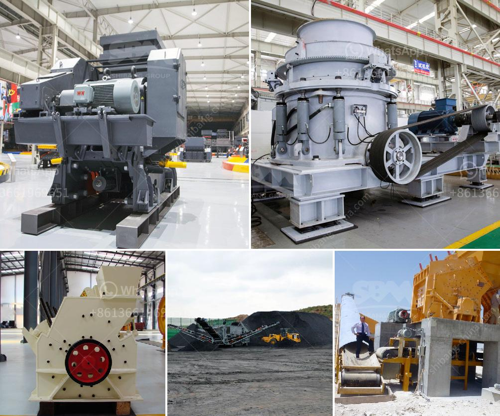

<h3>cost of barite crusher in nigeria</h3>
Barite is one of the important components used in the manufacturing of drilling mud or fluid for oil and gas exploration companies. The high density of barite makes it an ideal choice for this purpose. Due to its widespread usage, the demand for barite crusher and its components is on the rise.

Barite is a naturally occurring mineral and it is found in abundance in Nigeria. It is estimated that Nigeria has over 40 million tons of barite deposits, with majority of the reserves located in the Benue Trough. Over time, the cost of barite crusher machines in Nigeria has continued to increase due to factors such as inflation, exchange rates, and increased production costs.

Nigeria's barite industry has been driven by the discovery of oil deposits in the country. This has led to increased demand for barite to support drilling activities. The growth of the oil and gas industry in Nigeria has created a huge market for barite crusher and drilling mud needs.

The cost of barite crusher in Nigeria is a factor that affected the realization of Nigeria's barite resource wealth, but also will create unfavorable factors in Africa market. To some extent, the decline in market price, the development of mining and the expansion of the use of common road construction materials and other industries, barite will continue to expand the scale of application, and further promote the rapid development of the Nigerian barite crusher and the associated processing industry.

In conclusion, the cost of barite crusher in Nigeria is influenced by both the domestic and international market factors. Nigeria is Africa's largest oil producer and our continued dependence on oil resources directly leads to a high demand for barite crusher and its components. As the oil and gas industry continues to grow, we can expect the cost of barite crusher in Nigeria to rise, making the exploration and production of new oil wells more costly. This highlights the need for Nigeria to diversify its economy and reduce dependency on oil, while also exploring alternative sources of energy.
<h3>Contact us</h3><ul><li><strong>Whatsapp:&nbsp;<a href="https://wa.me/8613661969651">+8613661969651</a></strong></li><li><a href="https://swt.shibang-china.com/?git&amp;zhl&amp;cost of barite crusher in nigeria"><strong>Online Service(chat now)</strong></a></li></ul><h3>Related</h3><ul><li><a href='types of ball mills.md'>types of ball mills</a></li><li><a href='stone crusher in oman.md'>stone crusher in oman</a></li><li><a href='sales of vertical conveyor belts.md'>sales of vertical conveyor belts</a></li><li><a href='allis jaw crushers.md'>allis jaw crushers</a></li><li><a href='dry process of manufacturing calcium phosphate.md'>dry process of manufacturing calcium phosphate</a></li></ul>