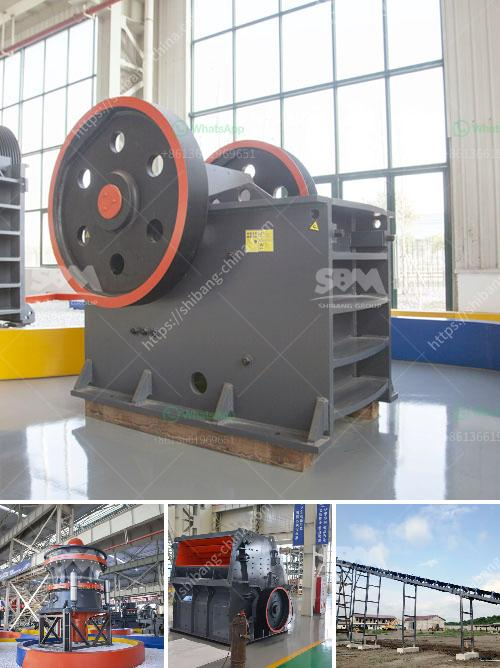

<h3>cost of cassava milling machine in ghana</h3>
The cost of cassava milling machine in Ghana is categorized based on diverse factors such as brand, designs, quality, mechanical specifications, and durability. Cassava milling machine is often sold either in local currency or foreign currency depending on the location of the seller. In Ghana, it is sold in local currency from GHS 8,000 to GHS 15,000.

The price of cassava milling machine in Ghana depends on the capacity, processing efficiency, brand name, and owner’s negotiation skills. In Ghana, one major obstacle that keeps many businesses from purchasing machinery is the lack of access to capital. However, there is a solution for that, as several loan agencies can provide financing for the procurement of cassava milling machines in Ghana.

Cassava milling machines in Ghana are made of durable materials such as stainless steel. This ensures the machine is long-lasting and able to withstand the harsh Ghanaian climate. A well-built cassava milling machine will save on both time and costs since it will process cassava with ease. However, finding a durable cassava milling machine for sale in Ghana can sometimes be daunting.

As mentioned earlier, the common varieties of cassava milling machines in Ghana are cassava grinding machine and cassava flour mill. The cost of cassava grinding machine varies greatly from place to place, and the estimated price range is around GHS 3,000 to GHS 7,000. Then, the cost of cassava flour mill plant includes the construction cost, machine cost, and transportation cost, which varies greatly depending on different equipment configurations. Typically, a small-scale cassava flour mill plant is made up of hygienic cassava washing and peeling machine, grating machine, fermentation system, dewatering system, milling and drying system.

Moreover, it should be noted that the cost of cassava milling machine in Ghana is influenced by other factors including after-sales service, maintenance, and technical support. A reputable supplier should offer reliable after-sales service and technical assistance to ensure the smooth operation of the cassava milling machines. This is essential in minimizing downtime and maximizing productivity.

In conclusion, the cost of cassava milling machine in Ghana is influenced by various factors such as brand, capacity, efficiency, durability, and after-sales service. As with any investment, it is important to conduct thorough research and compare prices from different suppliers before making a purchase. By doing so, individuals and businesses can find a cassava milling machine that meets their specific needs and budget, thus contributing to the growth of the cassava processing industry in Ghana.
<h3>Contact us</h3><ul><li><strong>Whatsapp:&nbsp;<a href="https://wa.me/8613661969651">+8613661969651</a></strong></li><li><a href="https://swt.shibang-china.com/?git&amp;zhl&amp;cost of cassava milling machine in ghana"><strong>Online Service(chat now)</strong></a></li></ul><h3>Related</h3><ul><li><a href='raymond ultra fine grinding mill.md'>raymond ultra fine grinding mill</a></li><li><a href='aggregates crusher philippines.md'>aggregates crusher philippines</a></li><li><a href='ball mill capacity of tons.md'>ball mill capacity of tons</a></li><li><a href='rock crushing plant mobile.md'>rock crushing plant mobile</a></li><li><a href='charcoal crusher kenya.md'>charcoal crusher kenya</a></li></ul>