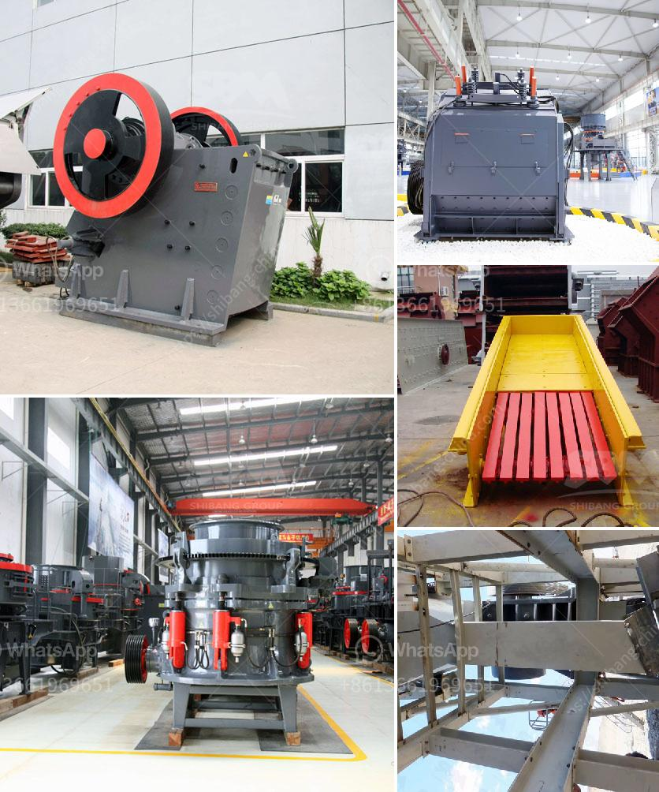

<h3>cost of converyer belts in south africa</h3>
The cost of conveyor belts in South Africa is a significant factor to consider for any company operating in the region. With various conveyor belt types, including rubber, steel cord, and PVC belting, being used across industries, the price range for conveyor belts in South Africa can vary considerably.

One of the factors affecting the cost of conveyor belts is the material used in their production. Rubber belts are commonly used due to their versatility and durability. However, these belts can be more expensive than alternatives such as PVC belts. The cost of rubber belts is influenced by factors such as the quality and thickness of the rubber used. Moreover, steel cord belts, used mainly in heavy-duty applications like mining and construction, can also come at a higher price point due to their exceptional strength.

The length and width of the conveyor belt required also impact the overall cost. Longer and wider belts are generally pricier due to the increased materials used in their manufacturing. Additionally, specialized accessories and features, such as cleats or sidewalls, can affect the price.

The brand and reputation of the conveyor belt manufacturer also play a role in pricing. Well-established brands with a track record of quality and reliability often come at a premium compared to lesser-known manufacturers.

It is essential for companies to carefully evaluate their requirements, considering factors like application, load capacity, material handled, and operating conditions, to determine the most suitable and cost-effective conveyor belt for their needs. Consulting with experts in the field of conveyor belts can help in making an informed decision.

In conclusion, the cost of conveyor belts in South Africa varies depending on factors such as the material used, size requirements, and brand reputation. Investing in high-quality and suitable conveyor belts is crucial for the smooth operation of businesses across industries, promoting efficiency and enhancing productivity.
<h3>Contact us</h3><ul><li><strong>Whatsapp:&nbsp;<a href="https://wa.me/8613661969651">+8613661969651</a></strong></li><li><a href="https://swt.shibang-china.com/?git&amp;zhl&amp;cost of converyer belts in south africa"><strong>Online Service(chat now)</strong></a></li></ul><h3>Related</h3><ul><li><a href='used equipment ball mill sale.md'>used equipment ball mill sale</a></li><li><a href='crusher machine for making sand from stone.md'>crusher machine for making sand from stone</a></li><li><a href='small mechanical jaw crusher singapore.md'>small mechanical jaw crusher singapore</a></li><li><a href='made for conveyor belts in uae.md'>made for conveyor belts in uae</a></li><li><a href='cost of converyer belts in south africa.md'>cost of converyer belts in south africa</a></li></ul>