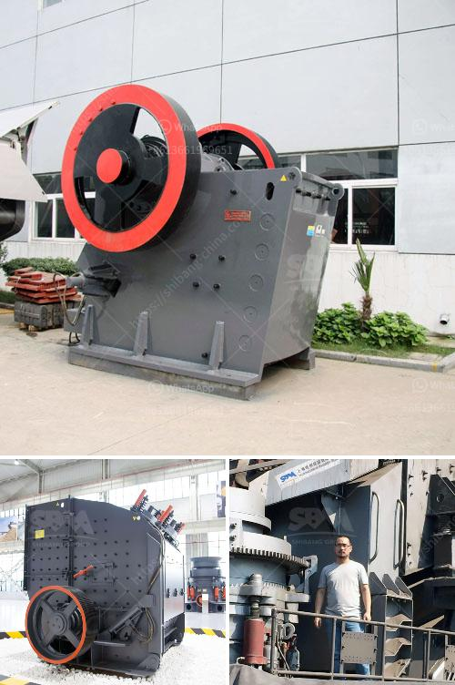

<h3>cost of crushing equipments in nigeria</h3>
The cost of crushing equipment in Nigeria cannot be overemphasized. As a developing country, the need for infrastructural development cannot be overemphasized. The construction industry is key to driving this growth, and crushing equipment plays a vital role in the production processes to ensure productivity and efficiency.

Crushing equipment is used to break large stones into smaller sizes or gravel, which is essential for construction projects such as roads, bridges, buildings, and more. However, the cost of acquiring this crucial equipment can be a significant challenge for many construction companies and individuals in Nigeria.

The cost of crushing equipment in Nigeria typically varies based on several factors such as the capacity, brand, durability, and quality of the equipment. There are different types of crushing equipment available in the market, including jaw crushers, cone crushers, impact crushers, and vibrating screens.

Jaw crushers are commonly used for primary crushing and are ideal for both stationary and mobile applications. Cone crushers are best for secondary and tertiary crushing, while impact crushers are suitable for crushing various materials of different sizes.

In recent years, the Nigerian government has taken steps to encourage local production and reduce dependency on imported crushing equipment. This has led to the establishment of local manufacturing plants that are gradually reducing the cost of crushing equipment in Nigeria.

Furthermore, there are also options for renting crushing equipment instead of outright purchase. This can be a cost-effective solution, especially for smaller projects or companies that do not require crushing equipment on a long-term basis.

In conclusion, the cost of crushing equipment in Nigeria remains a major concern for construction companies and individuals. However, with the emergence of local manufacturers and the option of equipment rental, the cost is gradually becoming more affordable. It is important for stakeholders in the construction industry to explore these options and leverage the available resources to ensure efficient and cost-effective crushing processes in Nigeria.
<h3>Contact us</h3><ul><li><strong>Whatsapp:&nbsp;<a href="https://wa.me/8613661969651">+8613661969651</a></strong></li><li><a href="https://swt.shibang-china.com/?git&amp;zhl&amp;cost of crushing equipments in nigeria"><strong>Online Service(chat now)</strong></a></li></ul><h3>Related</h3><ul><li><a href='used cement crushers for sale.md'>used cement crushers for sale</a></li><li><a href='jaw crusher altairac.md'>jaw crusher altairac</a></li><li><a href='stone crusher supplier company.md'>stone crusher supplier company</a></li><li><a href='granite quarry in nigeria.md'>granite quarry in nigeria</a></li><li><a href='gypsum powder production business plan.md'>gypsum powder production business plan</a></li></ul>