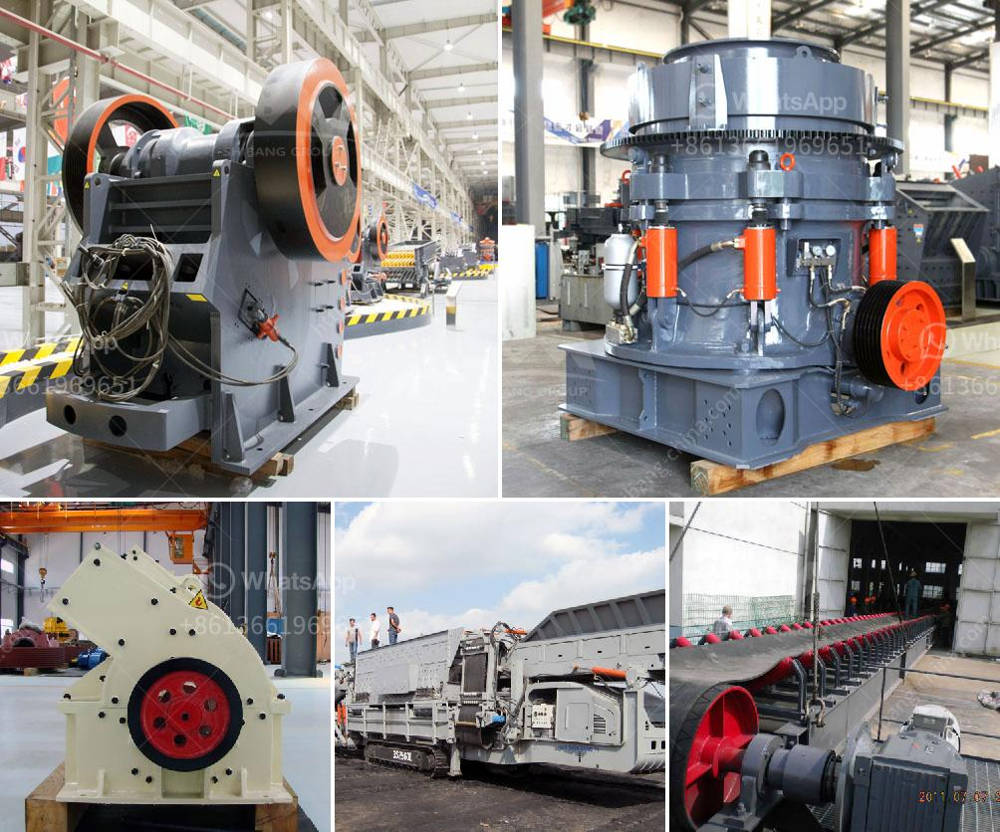

<h3>cost of equipment used in mining lead ore</h3>
The mining industry is a crucial sector in the global economy. It plays a significant role in the extraction of valuable minerals and metals, including lead ore. Lead ore is one of the main sources of lead, a versatile and essential element used in various industries, such as construction, batteries, and electronics.

However, mining lead ore comes at a cost, not only in terms of environmental impact but also regarding the equipment and machinery required for its extraction. The cost of equipment used in mining lead ore is a crucial consideration to ensure its viability and profitability.

Mining operations involve multiple stages, including exploration, mine development, extraction, processing, and closure. Each phase requires specialized equipment and machinery designed to handle the unique challenges and requirements of lead ore mining.

The initial stage of exploration involves geologists and engineers conducting surveys to locate potentially viable lead ore deposits. This process requires the use of various equipment, such as remote sensing devices, drones, GPS systems, and analytical instruments, which can incur substantial costs.

Once a potential lead ore deposit is identified, the mine development phase begins. This stage involves the construction of infrastructure and necessary facilities, such as access roads, power supply networks, water systems, and housing for workers. The cost of heavy machinery, including bulldozers, excavators, and trucks, is also a significant consideration during this phase.

After mine development, the extraction phase commences, wherein the actual lead ore extraction takes place. Specialized equipment, such as drills, loaders, and underground mining equipment, is required to extract the ore safely and efficiently. These machines, being heavy-duty and subject to high wear and tear, can have substantial costs in terms of purchase, operation, and maintenance.

Furthermore, the processing phase, where the extracted lead ore undergoes beneficiation processes to separate the valuable metal from other impurities, also requires specific equipment. This can include crushing and grinding equipment, flotation cells, filters, and smelting furnaces. The cost of such equipment can be significant and may vary depending on factors such as the scale of the operation and the desired processing capacity.

Lastly, the closure phase of a lead ore mine requires the proper disposal and remediation of waste materials, reclamation of the land, and closure of infrastructure and facilities. This may involve additional equipment, such as environmental monitoring devices, waste management systems, and rehabilitation machinery. The cost of these equipment and activities is necessary to ensure the mine's responsible closure and minimize any potential environmental harm.

In conclusion, the cost of equipment used in mining lead ore is a critical factor in the overall profitability and sustainability of lead mining operations. From exploration to extraction, processing, and closure, specialized machinery and equipment are essential to ensure efficient and safe mining practices. However, the high cost of acquiring, operating, and maintaining such equipment must be carefully considered and managed to maximize the economic benefits of lead ore mining while minimizing its environmental impact.
<h3>Contact us</h3><ul><li><strong>Whatsapp:&nbsp;<a href="https://wa.me/8613661969651">+8613661969651</a></strong></li><li><a href="https://swt.shibang-china.com/?git&amp;zhl&amp;cost of equipment used in mining lead ore"><strong>Online Service(chat now)</strong></a></li></ul><h3>Related</h3><ul><li><a href='dolomite crushing plant.md'>dolomite crushing plant</a></li><li><a href='roller crusher equipment manufacturer.md'>roller crusher equipment manufacturer</a></li><li><a href='copper concentrate mobile crusher.md'>copper concentrate mobile crusher</a></li><li><a href='roller crusher for coal.md'>roller crusher for coal</a></li><li><a href='cost of vertical roller mill clinker grinding.md'>cost of vertical roller mill clinker grinding</a></li></ul>