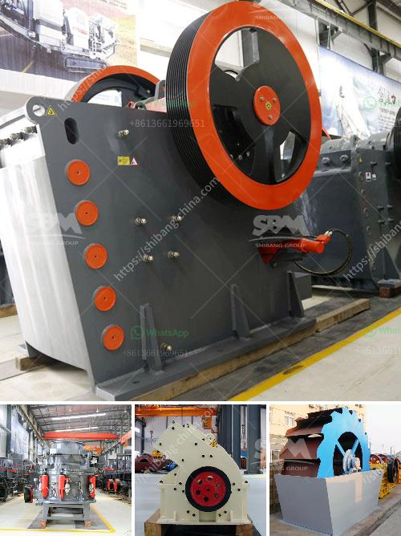

<h3>cost of granite crushing equipment</h3>
Granite is a type of igneous rock formed from the crystallization of magma deep underground. It is known for its strength and durability, making it an excellent material for construction and landscaping projects. When granite is quarried from the earth, it needs to be crushed into smaller pieces before it can be used for various purposes. This is where granite crushing equipment comes into play.

Granite crushing equipment refers to the machines used to crush granite into small fragments or granulate for construction applications. The machinery involved includes jaw crushers, impact crushers, cone crushers, and other types of machines. In order to ensure the quality of the final product, the granite crushing equipment typically has a vibrating screen and a conveyor belt.

The cost of granite crushing equipment can vary significantly depending on the size of the machine, the capacity of the machine, and the specific requirements of the project. Some of the factors that can influence the cost include the following:

1. Size of the machine: Larger machines generally have higher production capacities and can process more material in a shorter amount of time. However, they are also more expensive to purchase and operate.

2. Capacity of the machine: The capacity of the granite crushing equipment refers to the maximum amount of material it can process within a given period of time. Machines with higher capacities are generally more expensive.

3. Specific requirements of the project: Different projects may have different requirements in terms of the size and quality of the crushed granite. Machines that can produce a finer product or meet specific size specifications may cost more.

In addition to the initial cost of purchasing the equipment, there are also other costs associated with operating and maintaining the machines. These include fuel costs, electricity costs, and maintenance and repair costs. It is important to take these factors into consideration when estimating the overall cost of granite crushing equipment.

Despite the costs involved, investing in granite crushing equipment can provide long-term benefits for construction companies, landscapers, and other businesses. Crushed granite can be used for a wide range of applications, such as road construction, building foundations, and landscaping projects. By crushing granite on-site, businesses can save money on transportation costs and have greater control over the quality of the final product.

In conclusion, the cost of granite crushing equipment can vary depending on various factors, such as the size and capacity of the machine and the specific requirements of the project. Despite the costs involved, investing in this equipment can bring long-term benefits for businesses in the construction and landscaping industries.
<h3>Contact us</h3><ul><li><strong>Whatsapp:&nbsp;<a href="https://wa.me/8613661969651">+8613661969651</a></strong></li><li><a href="https://swt.shibang-china.com/?git&amp;zhl&amp;cost of granite crushing equipment"><strong>Online Service(chat now)</strong></a></li></ul><h3>Related</h3><ul><li><a href='ball mill cement plant.md'>ball mill cement plant</a></li><li><a href='manufacturing equipments of lime stone milling.md'>manufacturing equipments of lime stone milling</a></li><li><a href='turkey quarry machines manufacturer.md'>turkey quarry machines manufacturer</a></li><li><a href='grinding garnet machine.md'>grinding garnet machine</a></li><li><a href='methods of hammer mill.md'>methods of hammer mill</a></li></ul>