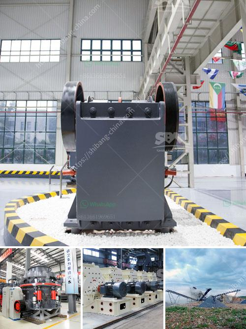

<h3>cost of graphite beneficiation plant</h3>
Graphite beneficiation is an important and highly adaptable process for industries that need high-quality graphite products. With the growing demand for graphite in various industries such as electronics, batteries, automobile parts, and lubricants, it is essential to have a cost-effective and efficient beneficiation plant.

The cost of setting up a graphite beneficiation plant varies depending on factors such as location, size, capacity, and technology used. However, considering the growing demand for graphite products and the need for high-quality graphite, investing in a beneficiation plant can be a lucrative venture.

One of the major cost components of setting up a beneficiation plant is the capital investment required for purchasing and installing the necessary equipment. The equipment required for the beneficiation process includes crushers, ball mills, vibrating screens, flotation cells, and other machinery. The cost of these equipment pieces can vary depending on their capacity, quality, and suppliers. Additionally, the cost of infrastructure, such as buildings, power supply, and water treatment, should also be considered.

The process of graphite beneficiation typically involves crushing the raw ore into smaller particles, followed by grinding and flotation processes. These processes require a significant amount of energy and consumables, increasing the overall operating costs of the plant. The cost of energy depends on factors such as location, availability of electricity, and the type of energy sources used. Consumables such as reagents, grinding media, and chemicals are necessary to facilitate the beneficiation process and ensure high-quality graphite products.

Additionally, the cost of labor should also be taken into account when considering the cost of setting up a beneficiation plant. Skilled technicians and operators are essential for operating and maintaining the plant effectively. The availability of skilled labor in the specific location should be evaluated, as it may impact the overall cost of labor.

Apart from the initial capital investment and operating costs, the economic viability of a graphite beneficiation plant also depends on factors such as market demand, pricing, and competition. It is important to conduct a thorough market analysis to assess the potential demand for graphite products in the targeted industries and regions. In addition, considering the cost of raw materials and the competitiveness of existing suppliers is crucial for assessing the profitability of the plant.

In conclusion, setting up a graphite beneficiation plant involves significant initial capital investment and ongoing operating costs. However, considering the growing demand for high-quality graphite products in various industries, investing in a beneficiation plant can be a profitable venture. Evaluating factors such as location, size, capacity, technology, labor costs, and market demand is essential for determining the cost of setting up a beneficiation plant. Conducting a comprehensive feasibility study and market analysis can help investors make informed decisions and ensure the viability of the plant in the long run.
<h3>Contact us</h3><ul><li><strong>Whatsapp:&nbsp;<a href="https://wa.me/8613661969651">+8613661969651</a></strong></li><li><a href="https://swt.shibang-china.com/?git&amp;zhl&amp;cost of graphite beneficiation plant"><strong>Online Service(chat now)</strong></a></li></ul><h3>Related</h3><ul><li><a href='raymond mill and high pressure difference.md'>raymond mill and high pressure difference</a></li><li><a href='cost of crushing equipments in nigeria.md'>cost of crushing equipments in nigeria</a></li><li><a href='dry calcium carbonate 3 5 micron production.md'>dry calcium carbonate 3 5 micron production</a></li><li><a href='roller mill for mantles.md'>roller mill for mantles</a></li><li><a href='crushing plant for irion ore.md'>crushing plant for irion ore</a></li></ul>