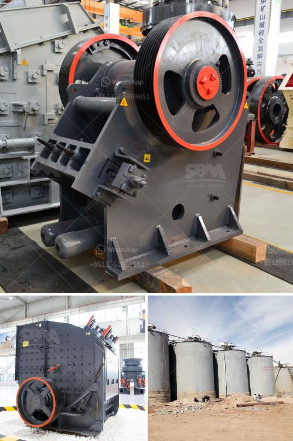

<h3>cost of grinding machines</h3>
Grinding machines are essential tools used in metalworking and other industrial sectors. They are responsible for shaping materials by removing unwanted parts through the process of abrasion. Considering the amount of precision and efficiency required in many industries, the cost of grinding machines can vary depending on various factors.

One significant factor affecting the cost of grinding machines is the type of grinder being used. There is a wide range of grinder types available in the market, each designed for specific applications. The most common types include surface grinders, cylindrical grinders, centerless grinders, and tool and cutter grinders. Each type has its unique features and advantages, leading to different costs.

Surface grinders, for example, are used to produce a smooth finish on flat surfaces. They utilize a horizontally rotating grinding wheel and a reciprocating worktable, enabling precise material removal. Due to their versatility and widespread use, surface grinders are generally more affordable compared to specialized grinders.

On the other hand, specialized grinders designed for specific applications like centerless grinding tend to be more expensive. Centerless grinders are used for high-precision grinding operations by removing material from the workpiece without using centers or chucks. Their complex design and intricate mechanisms contribute to their higher cost.

In addition to the type of grinder, the size and capacity of the machine also influence its cost. Grinding machines come in various sizes, ranging from small handheld units to large industrial-grade machines. The larger the machine's size and capacity, the higher the cost will be. This is because larger machines require more materials and advanced engineering to ensure optimal performance and durability.

Furthermore, another cost-inducing factor is the level of automation and technological advancements incorporated into the grinding machine. Traditional manual grinding machines tend to be less expensive compared to their computer numerical control (CNC) counterparts. CNC grinding machines are equipped with advanced control systems, precise positioning mechanisms, and automated tool changers, enabling high-speed and accurate grinding operations. While the initial investment for CNC machines might be higher, they offer increased productivity, improved quality, and reduced human error, ultimately translating into cost savings in the long run.

Additional features and accessories also impact the overall cost of grinding machines. For instance, some machines may be equipped with automated coolant systems, dust collectors, and advanced safety features. These additional features add value to the machine but also increase its price. However, it is important to consider the needs and requirements of the specific application to determine whether the additional cost for these features is justified.

Lastly, the brand and reputation of the manufacturer can influence the cost of grinding machines. Established and renowned brands with a history of producing high-quality machines tend to have higher price tags. However, investing in a reputable brand ensures reliability, durability, and access to after-sales support and spare parts, which can be crucial for long-term productivity.

In conclusion, the cost of grinding machines can vary significantly based on several factors. These include the type of grinder, its size and capacity, level of automation, additional features, and the brand. When selecting a grinding machine, it is essential to evaluate these factors while considering the specific application requirements and long-term cost-effectiveness.
<h3>Contact us</h3><ul><li><strong>Whatsapp:&nbsp;<a href="https://wa.me/8613661969651">+8613661969651</a></strong></li><li><a href="https://swt.shibang-china.com/?git&amp;zhl&amp;cost of grinding machines"><strong>Online Service(chat now)</strong></a></li></ul><h3>Related</h3><ul><li><a href='quartz crushing machine price.md'>quartz crushing machine price</a></li><li><a href='manufacture of conveyor belts in mexico.md'>manufacture of conveyor belts in mexico</a></li><li><a href='gypsum production plant.md'>gypsum production plant</a></li><li><a href='crusher gap crusher.md'>crusher gap crusher</a></li><li><a href='barium sulfate production line manufacturer.md'>barium sulfate production line manufacturer</a></li></ul>