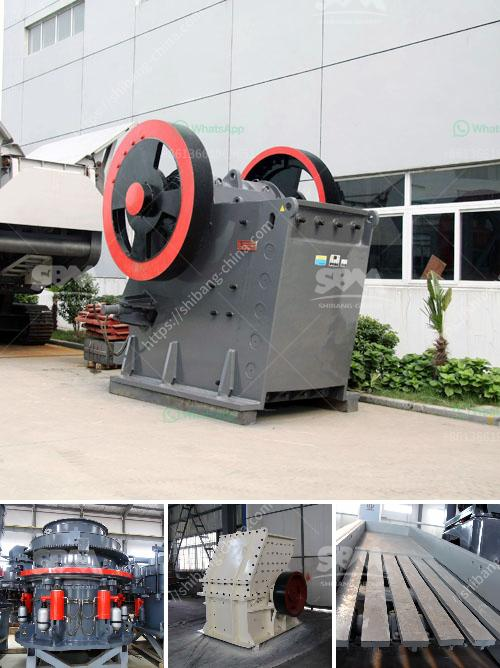

<h3>cost of grinding mills for building</h3>
Grinding mills play a critical role in the building industry as they are essential for turning raw materials into usable building materials. These mills are instrumental in the process of crushing, grinding, and mixing the raw materials to create the desired consistency and shape. However, one crucial factor that needs to be considered before purchasing grinding mills is their cost.

The cost of grinding mills can vary significantly depending on various factors such as the size, capacity, and design. Smaller capacity mills are generally cheaper compared to larger industrial-grade mills that have a higher production capacity. Additionally, the materials used in the construction of the mill and the type of grinding mechanism also contribute to the cost.

The market for grinding mills is competitive, with various manufacturers and suppliers offering a wide range of options. These options may include different types of mills such as ball mills, hammer mills, or roller mills, each designed for specific applications and materials. The cost of these mills can vary accordingly, with more specialized and industrial-grade mills generally being more expensive.

It is important for builders and contractors to carefully assess their project requirements and budget before selecting a grinding mill. Factors such as the desired output capacity, the type of materials to be ground, and the required fineness should all be taken into consideration. It is also crucial to research and compare prices from different suppliers to ensure the best value for money.

While cost is an important consideration, builders should also keep in mind the long-term benefits and durability of the grinding mills. Investing in a high-quality mill that offers efficient performance and requires minimal maintenance can save costs in the long run, as it reduces downtime and increases productivity.

In conclusion, the cost of grinding mills for building purposes can vary based on factors such as size, capacity, design, and materials used in construction. Builders should not only focus on the initial cost but also consider the long-term benefits and durability of the mills. By carefully assessing their project requirements and researching different suppliers, builders can find the most suitable grinding mill that provides the best value for their investment.
<h3>Contact us</h3><ul><li><strong>Whatsapp:&nbsp;<a href="https://wa.me/8613661969651">+8613661969651</a></strong></li><li><a href="https://swt.shibang-china.com/?git&amp;zhl&amp;cost of grinding mills for building"><strong>Online Service(chat now)</strong></a></li></ul><h3>Related</h3><ul><li><a href='basalt production plant.md'>basalt production plant</a></li><li><a href='used crusher for sale in tanzania.md'>used crusher for sale in tanzania</a></li><li><a href='crusher manufacturers in saudi.md'>crusher manufacturers in saudi</a></li><li><a href='quartz stone machine in turkey.md'>quartz stone machine in turkey</a></li><li><a href='calcium processing plant.md'>calcium processing plant</a></li></ul>