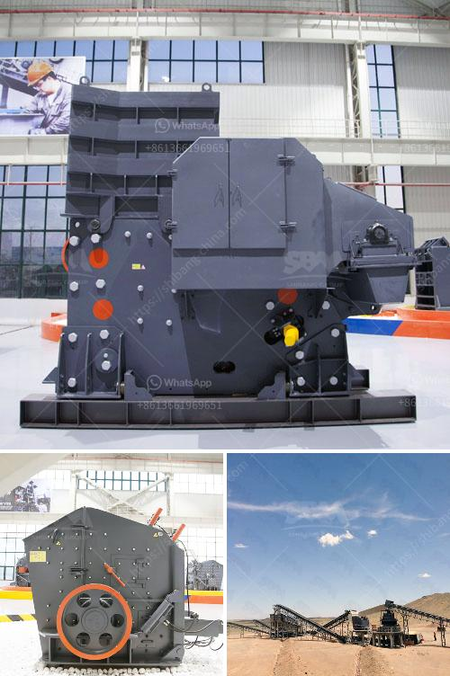

<h3>cost of grizzly crusher</h3>
The cost of a grizzly crusher is an important factor to consider when investing in a crushing machine. This article aims to provide an overview of the cost of a grizzly crusher, its various components, and factors that may contribute to the overall cost.

Firstly, let's define what a grizzly crusher is. A grizzly crusher, also known as a grizzly scalper or a grizzly feeder, is an essential machine in the mining and aggregate industry. It is used to separate large rocks and materials from finer ones before the primary crushing process.

The cost of a grizzly crusher can vary significantly depending on several factors. The main components that contribute to the overall cost are the size of the machine, the capacity it can handle, and the type of material it processes. Additionally, the brand, location, and any additional customization required also impact the price.

Size plays a crucial role in determining the cost of a grizzly crusher. Smaller machines with lower capacities are generally more affordable compared to larger ones capable of handling higher volumes of material. It is essential to assess the anticipated production requirements and choose a grizzly crusher that meets those needs without overpaying for excessive capacity.

The type of material being processed is another significant factor affecting the cost. Different materials have varying hardness, density, and abrasiveness properties, which can impact the wear and tear on the grizzly crusher's components. Consequently, crushers designed to handle more challenging materials tend to be more expensive due to the additional engineering and construction required.

Brand reputation can also influence the cost of a grizzly crusher. Well-established manufacturers often have higher prices due to their brand value, proven track record, and overall quality and reliability. While opting for a reputable brand can provide peace of mind, there are also more affordable options available from lesser-known manufacturers that may still deliver satisfactory performance.

The location of purchase can also affect the cost due to shipping and taxes. Buying a grizzly crusher locally may be more cost-effective than importing it from another country. It is crucial to evaluate all associated expenses to ensure that the overall cost remains within budget.

Customization is an essential consideration when it comes to the cost of a grizzly crusher. Additional features or modifications, such as special chutes, extended hoppers, or different types of wear liners, can significantly impact the final price. It is important to discuss and negotiate these requirements with the manufacturer to avoid any unexpected cost escalation.

In conclusion, the cost of a grizzly crusher is influenced by several factors, including size, capacity, material type, brand reputation, location, and customization. By carefully evaluating these factors and considering the specific needs of the operation, it is possible to choose a grizzly crusher that strikes the right balance between cost and performance. Investing in a reliable and efficient grizzly crusher is crucial for optimizing productivity and profitability in the mining and aggregate industry.
<h3>Contact us</h3><ul><li><strong>Whatsapp:&nbsp;<a href="https://wa.me/8613661969651">+8613661969651</a></strong></li><li><a href="https://swt.shibang-china.com/?git&amp;zhl&amp;cost of grizzly crusher"><strong>Online Service(chat now)</strong></a></li></ul><h3>Related</h3><ul><li><a href='sand and gravel separator machine for sale philippines.md'>sand and gravel separator machine for sale philippines</a></li><li><a href='ball mill capacity 10 tph in malaysia.md'>ball mill capacity 10 tph in malaysia</a></li><li><a href='aggregates crusher philippines.md'>aggregates crusher philippines</a></li><li><a href='how does a quarry operate complete crushing palnt.md'>how does a quarry operate complete crushing palnt</a></li><li><a href='south africa mobile rock crusher.md'>south africa mobile rock crusher</a></li></ul>