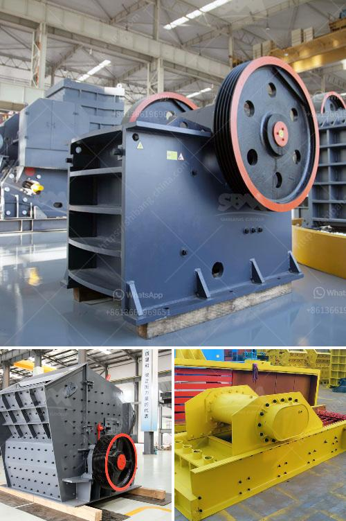

<h3>cost of gypsum mining equipment</h3>
Gypsum is a mineral that is widely used in construction and agricultural applications. It is a highly valued resource in various industries, as it provides numerous benefits, such as improving soil fertility, removing toxins from wastewater, and strengthening building materials. However, the process of mining gypsum can be challenging and costly, leading to a need for high-quality mining equipment.

The cost of gypsum mining equipment is influenced by several factors, including the location and size of the deposit, the depth of the deposit, and the nature of the soil and overburden. The equipment itself also influences the cost, as some machines are more efficient in terms of energy consumption and require less maintenance.

One of the most critical pieces of equipment in gypsum mining is the crusher machine, which breaks down large-sized gypsum ore into smaller particles. Crushing the material to the required size allows for easy handling and transportation, which can significantly reduce overall mining costs. Crushers vary in size and capacity, ranging from small, handheld machines to large, industrial units. The choice of crusher depends on the specific requirements of the mining operation.

Another essential piece of equipment in gypsum mining is the grinding mill, which is used to grind the mined gypsum into a fine powder. This powder is then used in various applications such as wallboard, cement production, and agriculture. Grinding mills come in different sizes and configurations, including ball mills, vertical roller mills, and hammer mills. The selection of the appropriate grinding mill depends on factors such as the desired particle size, capacity, and energy efficiency.

In addition to crushers and grinding mills, other equipment commonly used in gypsum mining includes loaders, trucks, excavators, and conveyors. These machines are used to move and transport the gypsum ore and its by-products throughout the mining site.

The cost of gypsum mining equipment can range from a few thousand dollars to millions of dollars, depending on the size and complexity of the operation. To ensure the efficient and cost-effective operation of gypsum mining, it is essential to invest in high-quality equipment that meets the specific needs of the operation. By selecting the right equipment for the job, mining companies can reduce operational costs, increase productivity, and maximize the value of their gypsum resources.
<h3>Contact us</h3><ul><li><strong>Whatsapp:&nbsp;<a href="https://wa.me/8613661969651">+8613661969651</a></strong></li><li><a href="https://swt.shibang-china.com/?git&amp;zhl&amp;cost of gypsum mining equipment"><strong>Online Service(chat now)</strong></a></li></ul><h3>Related</h3><ul><li><a href='used equipment cement for sale vertical roller mills.md'>used equipment cement for sale vertical roller mills</a></li><li><a href='marble quarry equipment.md'>marble quarry equipment</a></li><li><a href='gold ore processing equipment manufacturer india.md'>gold ore processing equipment manufacturer india</a></li><li><a href='super fine grinding mills.md'>super fine grinding mills</a></li><li><a href='limestone crushing screening plant sandtrap.md'>limestone crushing screening plant sandtrap</a></li></ul>