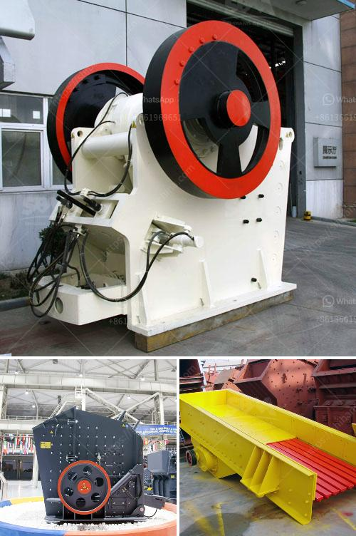

<h3>cost of lead zinc beneficiation plant</h3>
The cost of lead zinc beneficiation plant is relevant when determining the profit margin of a mining operation. The overall potential of the mine to generate revenue and the associated risks and expenses are important factors in assessing the viability of a mining project. In this article, we will delve into the aspects that influence the cost of setting up a lead zinc beneficiation plant and explore the factors that should be considered in cost estimation.

The lead zinc beneficiation plant is designed to process 1.14 million tonnes of ore per year. The main focus is to extract zinc and lead from the mined ore, resulting in relatively pure zinc and lead concentrates suitable for export and further processing at the smelter.

One of the major cost factors in setting up a beneficiation plant is the cost of acquiring the necessary machinery, equipment, and associated infrastructure. This includes crushers, grinders, flotation equipment, thickening and filtering equipment, as well as storage tanks and piping systems. The cost of purchasing such equipment can vary greatly depending on the size and complexity of the plant.

Furthermore, labor and operating costs are key aspects to consider. Skilled laborers are required to operate the plant efficiently and effectively. Additionally, there will be a need for maintenance personnel to ensure the smooth running of the equipment and address any potential issues promptly.

The energy requirements of the plant are another important factor to take into account. The beneficiation process typically involves crushing and grinding of the ore, followed by flotation to separate the zinc and lead concentrates. These processes require a significant amount of energy, which contributes to the overall cost.

Water is also an essential resource in the beneficiation process. It is needed for the slurry formation, flotation, and various other stages. The cost of accessing and treating water, as well as managing the wastewater generated during the process, should be included in the cost estimation.

Another aspect to consider is the environmental impact of the beneficiation plant. Proper waste management, dust control, and remediation measures are necessary to comply with environmental regulations. Implementing these measures may increase the initial cost, but it is crucial for the long-term sustainability of the operation.

Considering the scale and complexity of the lead zinc beneficiation plant, it is essential to have an accurate estimation of the operating and maintenance costs. This will allow for proper financial planning and ensure that sufficient funds are allocated to cover these expenses.

In conclusion, the cost of setting up a lead zinc beneficiation plant encompasses various aspects such as equipment procurement, labor, energy, water, and environmental mitigation measures. A thorough cost estimation is crucial to determine the viability and profitability of the project. By considering these factors in the estimation process, mining companies can make informed decisions and achieve successful and sustainable operations.
<h3>Contact us</h3><ul><li><strong>Whatsapp:&nbsp;<a href="https://wa.me/8613661969651">+8613661969651</a></strong></li><li><a href="https://swt.shibang-china.com/?git&amp;zhl&amp;cost of lead zinc beneficiation plant"><strong>Online Service(chat now)</strong></a></li></ul><h3>Related</h3><ul><li><a href='raymond mill production line.md'>raymond mill production line</a></li><li><a href='vail crushing meachine models in pharma.md'>vail crushing meachine models in pharma</a></li><li><a href='coal mining vibrating screens.md'>coal mining vibrating screens</a></li><li><a href='limestone washing and classifi ion.md'>limestone washing and classifi ion</a></li><li><a href='marble processing machines.md'>marble processing machines</a></li></ul>