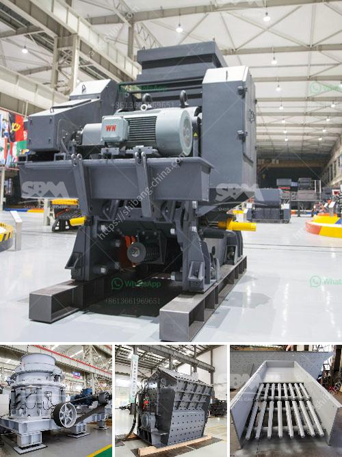

<h3>cost of mobile stone crusher</h3>
The mobile stone crusher with the capacity of 200-600 tons per hour can be a necessary machine in the primary crushing stage, and the 50-100-ton mobile jaw crusher is suitable for this situation. The mobile stone crusher machine has the advantage of reasonable matching, unobstructed discharge, reliable performance, convenient operation, high efficiency, etc.

The cost of owning a stone crushing plant is relatively high, which is why many people want to buy it on a Mobile Crusher and retain it, just to ensure that they have something useful for their business. However, this comes at a significant cost. Not only will you have to purchase the equipment, but you will also have to pay for its maintenance, transportation, and other operating expenses.

The cost of a mobile stone crusher can vary depending on the country and the capacity. In addition to this, the type of crushed materials should also be considered, as different materials have different properties and require different types of crushers to process them properly. Moreover, the degree of automation and the scale of the crushing plant also affect the cost.

It is also important to consider the overall market demand and competition in the industry. If there is a high demand for crushed stones in your area, the cost of the mobile stone crusher may be relatively higher due to the increased competition. On the other hand, if there is a low demand, the cost may be lower as there is less competition.

In conclusion, the cost of a mobile stone crusher can vary depending on various factors such as country, capacity, type of crushed materials, degree of automation, and market demand. It is essential to carefully evaluate these factors and conduct thorough research before purchasing a mobile stone crusher to ensure that it is a cost-effective and suitable investment for your business.
<h3>Contact us</h3><ul><li><strong>Whatsapp:&nbsp;<a href="https://wa.me/8613661969651">+8613661969651</a></strong></li><li><a href="https://swt.shibang-china.com/?git&amp;zhl&amp;cost of mobile stone crusher"><strong>Online Service(chat now)</strong></a></li></ul><h3>Related</h3><ul><li><a href='equipment for mineral ore mining industry.md'>equipment for mineral ore mining industry</a></li><li><a href='gypsum board thailand manufacturer.md'>gypsum board thailand manufacturer</a></li><li><a href='portable cone crusher.md'>portable cone crusher</a></li><li><a href='stone crusher plant in uae.md'>stone crusher plant in uae</a></li><li><a href='manufacturer of conveyor belts.md'>manufacturer of conveyor belts</a></li></ul>