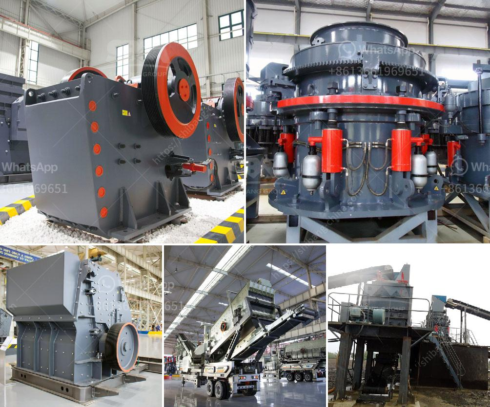

<h3>cost of setting up a mini cement plant in india</h3>
The cement industry in India is thriving, thanks to the growing demand for infrastructure development projects across the country. India ranks second in the world in terms of cement production, and its market is expected to reach 550 million tons by 2025. If you are considering investing in the cement business, setting up a mini cement plant in India can be a profitable venture.

The cost of setting up a mini cement plant varies depending on various factors, such as the size of the plant, the location, the availability of resources, and the labor costs. However, the average cost of a mini cement plant in India is around INR 25 to 35 lakhs (excluding land, building, and other infrastructure costs).

One of the major advantages of setting up a mini cement plant is the less capital investment required. Compared to large-scale cement plants, a mini cement plant requires less land and less raw material. Additionally, the operational costs are relatively lower, making it an attractive option for small and medium-scale entrepreneurs.

To set up a mini cement plant, the basic machinery required includes cement crusher, cement mill, belt conveyor, cement silo, and packing machine. Other auxiliary equipment may include wheel loaders, jaw crushers, and organizations for setting up machinery.

Apart from the machinery, you also need to consider the cost of land, permits, and licenses required to set up the plant. It is advisable to conduct a thorough feasibility study before investing in a cement plant to assess the market demand, competition, availability of raw materials, and other factors.

Moreover, it is essential to comply with environmental regulations and obtain necessary permits to ensure sustainable and responsible operations. Adhering to environmental norms will not only help in better resource management but also enhance the brand value and reputation of your cement plant.

In conclusion, setting up a mini cement plant in India is a profitable venture for entrepreneurs looking to enter the cement industry. It requires relatively less capital investment and offers competitive advantages compared to large-scale cement plants. However, thorough research, planning, and compliance with regulations are essential for a successful business. With a growing demand for cement in India, a mini cement plant can be a lucrative opportunity for business growth.
<h3>Contact us</h3><ul><li><strong>Whatsapp:&nbsp;<a href="https://wa.me/8613661969651">+8613661969651</a></strong></li><li><a href="https://swt.shibang-china.com/?git&amp;zhl&amp;cost of setting up a mini cement plant in india"><strong>Online Service(chat now)</strong></a></li></ul><h3>Related</h3><ul><li><a href='limestone washing and classifi ion.md'>limestone washing and classifi ion</a></li><li><a href='used crusher for sale in tanzania.md'>used crusher for sale in tanzania</a></li><li><a href='prices crusher prices gypsum crusher prices.md'>prices crusher prices gypsum crusher prices</a></li><li><a href='crushed sand manufacturing.md'>crushed sand manufacturing</a></li><li><a href='mill clay grinding in delhi.md'>mill clay grinding in delhi</a></li></ul>