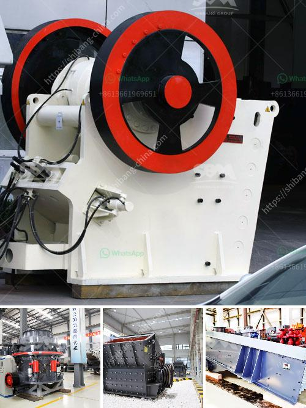

<h3>cost of vertical raw mill</h3>
The cost of a vertical raw mill is dependent on numerous factors, such as the capacity of the mill, the material being processed, and its unique specifications. These factors can vary greatly, making it challenging to provide an exact cost estimate. However, we can provide a general idea of the cost range for a vertical raw mill.

A vertical raw mill is a crucial equipment in various industries, primarily used for grinding raw materials into fine powders. This mill is commonly used in cement plants, mining operations, and other manufacturing processes requiring raw materials to be ground down to a smaller size.

The cost of a vertical raw mill typically ranges from tens of thousands to hundreds of thousands of dollars, depending on its capacity. Smaller mills with a lower capacity will generally have a lower cost, while larger mills with a higher capacity will be more expensive.

Other variables that may influence the cost of a vertical raw mill include the brand, the geographical location of the manufacturer, and any additional features or customizations required. Different manufacturers may have varying production costs, leading to different price points for similar mill models.

Furthermore, raw materials vary in terms of hardness, moisture content, and other characteristics, which can require mills to be specialized or have specific configurations. These specialized specifications can impact the cost of the mill.

It is important to consider not only the initial cost but also the long-term operational costs associated with a vertical raw mill. These costs may include energy consumption, maintenance, and spare parts. Investing in a high-quality mill from a reputable manufacturer can often lead to reduced operational costs over time.

Ultimately, the cost of a vertical raw mill is a complex calculation that depends on numerous factors. It is recommended to consult with an industry professional or directly contact manufacturers to obtain accurate cost estimations based on specific requirements.
<h3>Contact us</h3><ul><li><strong>Whatsapp:&nbsp;<a href="https://wa.me/8613661969651">+8613661969651</a></strong></li><li><a href="https://swt.shibang-china.com/?git&amp;zhl&amp;cost of vertical raw mill"><strong>Online Service(chat now)</strong></a></li></ul><h3>Related</h3><ul><li><a href='vsi crusher manufacturers.md'>vsi crusher manufacturers</a></li><li><a href='jaw crusher manufacturers in gujarat.md'>jaw crusher manufacturers in gujarat</a></li><li><a href='sand making machine in south africa.md'>sand making machine in south africa</a></li><li><a href='bauxite from cement plants in india.md'>bauxite from cement plants in india</a></li><li><a href='stone crusher rent based mobile machine.md'>stone crusher rent based mobile machine</a></li></ul>