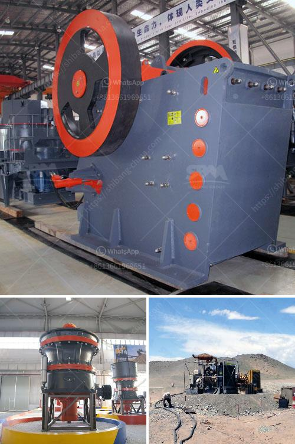

<h3>cost of vertical roller mill clinker grinding</h3>
The cost of vertical roller mill clinker grinding is a key factor to consider when choosing a grinding method. Vertical roller mills have many advantages over traditional ball mills, such as higher grinding efficiency, lower power consumption, and smaller physical footprint. However, the initial investment cost is higher than that of a ball mill, making it less accessible for smaller businesses or those with limited capital.

1. Equipment cost: The prices of vertical roller mill and other associated equipment such as feeders, conveyors, classifiers, etc. vary greatly, depending on the size, capacity, and features of the equipment. For example, a vertical roller mill with a capacity of 50 tons per hour and an annual output of 500,000 tons requires different prices for different models.

2. Auxiliary equipment cost: In addition to the main grinding equipment, there are also many auxiliary equipment required for clinker grinding, such as a bag filter, dust collector, and electric control system. The cost of these auxiliary equipment should also be taken into account when calculating the total cost.

3. Installation and commissioning cost: Vertical roller mills are complex machines that require professional installation and commissioning. The cost of installation and commissioning, including labor costs, transportation costs, and on-site training expenses, can add up significantly.

4. Maintenance and repair cost: Like any other mechanical equipment, vertical roller mills require regular maintenance and occasional repairs. The cost of spare parts, maintenance personnel, and downtime for repairs should be considered when evaluating the cost of a vertical roller mill clinker grinding plant.

5. Energy cost: Although vertical roller mills are more energy-efficient compared to traditional ball mills, they still require a significant amount of electricity to operate. The cost of electricity varies across different regions, so it's essential to consider the local energy prices when estimating the overall operating cost.

6. Production cost: The production cost of clinker grinding includes raw material cost, grinding aid cost, and production labor cost. These costs can vary depending on the source and availability of raw materials, the choice of grinding aids, and the labor wages in a specific region.

In conclusion, the cost of vertical roller mill clinker grinding depends on multiple factors, including the equipment cost, auxiliary equipment cost, installation and commissioning cost, maintenance and repair cost, energy cost, and production cost. It's essential for businesses to carefully evaluate these costs and compare them with the potential benefits of using vertical roller mills to determine if this grinding method is viable for their operations.
<h3>Contact us</h3><ul><li><strong>Whatsapp:&nbsp;<a href="https://wa.me/8613661969651">+8613661969651</a></strong></li><li><a href="https://swt.shibang-china.com/?git&amp;zhl&amp;cost of vertical roller mill clinker grinding"><strong>Online Service(chat now)</strong></a></li></ul><h3>Related</h3><ul><li><a href='cheap used jaw rock crushers for sale.md'>cheap used jaw rock crushers for sale</a></li><li><a href='ball milling method.md'>ball milling method</a></li><li><a href='calcium carbonate process flow diagram.md'>calcium carbonate process flow diagram</a></li><li><a href='dense medium separation equipment supplier.md'>dense medium separation equipment supplier</a></li><li><a href='lime making machine.md'>lime making machine</a></li></ul>