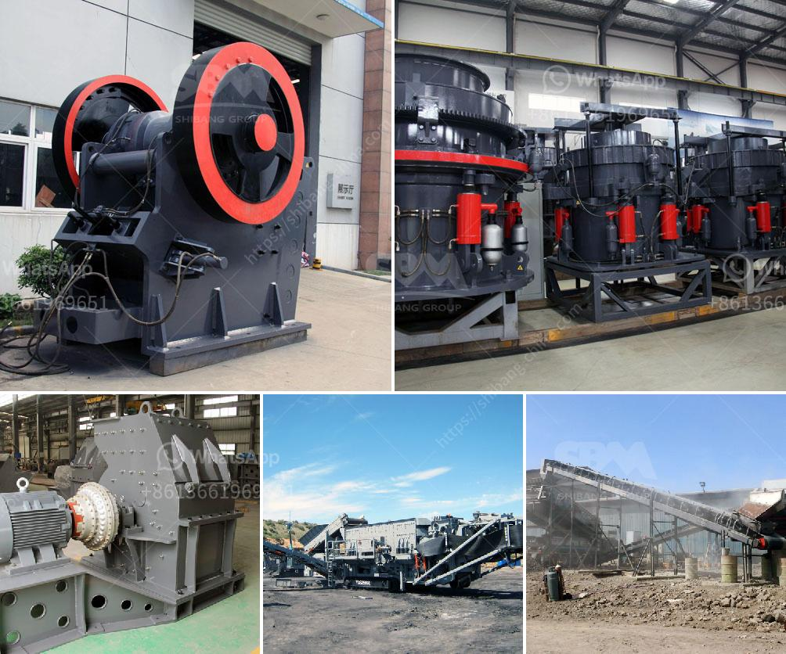

<h3>cost or operating stone quarry and crusher</h3>
The stone quarry and crushing industry is an important industrial sector in the country engaged in producing crushed stone used as raw material for various construction activities such as construction of roads, bridges, buildings, and canals. The stone crushing units can be seen in the vicinity of almost all major cities and towns.

Stone quarrying and crushing involves a variety of processes that create potential for exposure to a wide range of physical, chemical, and ergonomic hazards, which can cause serious health issues to the workers. Therefore, it is vital to invest in the necessary resources and equipment to ensure the safety and efficiency of operations.

The cost of operating a stone quarry and crusher can vary greatly depending on factors such as the size of the quarry, the nature of deposits, the geology, and the equipment used. It is an expensive process that requires significant investment upfront. However, as stone quarrying is a labor-intensive industry, investing in automation or technology-driven processes can help reduce operating costs, improve productivity, and increase profit margins.

Firstly, the cost of leasing land and acquiring necessary licenses and permits can be substantial. The location of the quarry also plays a crucial role in determining the cost of transporting the stone to urban centers. Access to transportation networks and proximity to potential clients are essential considerations when selecting a quarry site.

Furthermore, the costs of operating heavy machinery, such as loaders, excavators, and crushers, can make up a significant portion of the total expenses. Fuel, maintenance, and repair costs must be factored into the budget. Implementing efficient maintenance strategies and training the workforce on proper equipment handling can minimize breakdowns, reduce downtime, and cut down associated costs.

Moreover, compliance with environmental regulations is another factor that increases operating costs. Quarry operators must invest in pollution control equipment, such as dust collectors and water sprays, to minimize emissions and prevent contamination of surrounding areas.

Lastly, labor costs also contribute to the overall expenses. Hiring skilled and experienced workers and providing them with proper training and protective equipment comes at a cost. Nonetheless, prioritizing worker safety and wellbeing is crucial for any responsible quarry operator.

In conclusion, operating a stone quarry and crusher requires considerable investment and ongoing expenses. While costs can vary depending on multiple factors, implementing technology-driven processes, optimizing maintenance strategies, and prioritizing worker safety can help reduce operating expenses and improve the profitability of the operations.
<h3>Contact us</h3><ul><li><strong>Whatsapp:&nbsp;<a href="https://wa.me/8613661969651">+8613661969651</a></strong></li><li><a href="https://swt.shibang-china.com/?git&amp;zhl&amp;cost or operating stone quarry and crusher"><strong>Online Service(chat now)</strong></a></li></ul><h3>Related</h3><ul><li><a href='jaw crusher 30 x 12.md'>jaw crusher 30 x 12</a></li><li><a href='feldspar ball mills feldspar ball mills manufacturers.md'>feldspar ball mills feldspar ball mills manufacturers</a></li><li><a href='cost or operating stone quarry and crusher.md'>cost or operating stone quarry and crusher</a></li><li><a href='nigeria c125 jaw crusher.md'>nigeria c125 jaw crusher</a></li><li><a href='kohinoor stone crusher contact.md'>kohinoor stone crusher contact</a></li></ul>