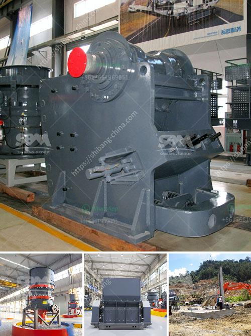

<h3>cost setting up silica sand ball mill</h3>
Silica sand, also known as quartz sand, is a type of industrial sand that is commonly used in glass manufacturing, foundry, construction and various other industries. Like other types of sand, it can be formed naturally through the erosion and weathering of rocks or artificially through crushing and grinding processes. Silica sand is highly sought after for its purity, consistency, and high melting point.

One of the key pieces of equipment used in this process is the silica sand ball mill. This powerful device grinds the silica sand into extremely fine powder through the collision and friction between the balls. At the same time, the silica sand is mixed with chemicals to make the material more suitable for the intended applications. The ball mill grind various ores and other materials either wet or dry. There are two kinds of ball mill, grate type and overfall type due to different ways of discharging material.

The cost of setting up a silica sand ball mill project is generally between USD 70,000 and USD 700,000. Depending on the actual project, the specific equipment required, and the quantities of various materials, the price may vary greatly. In addition, another factor that affects the cost of setting up a silica sand ball mill project is the transportation cost of the silica sand. Considering it is bulky and relatively heavy, the transportation cost can be significant, especially for projects located far away from the source of the silica sand.

Here are some of the main components that contribute to the overall cost of setting up a silica sand ball mill:

1. Ball mill: The ball mill itself is a crucial piece of equipment for any silica sand project. The ball mill grinds the material into a controlled and fine powder size. The presence of silica sand reduces the wear on the grinding media and this further reduces the energy consumption of the ball mill.

2. Silica sand: The silica sand used in the project makes up a significant portion of the cost. Pricing of silica sand can vary depending on the quality and quantity required. In some cases, silica sand may need to be processed further to remove impurities, which can add to the cost.

3. Chemicals: In order to improve the properties of the silica sand, certain chemicals may be added during the grinding process. These chemicals help in reducing the viscosity, improving the flowability, and enhancing the bonding properties of the silica sand.

4. Installation and labor costs: Setting up a silica sand ball mill project involves various installation and labor costs. This includes the cost of hiring skilled workers, procuring necessary equipment, and ensuring proper installation to achieve optimal performance.

5. Maintenance and operational costs: Once the silica sand ball mill is up and running, there will be routine maintenance and operational costs involved in maintaining the equipment. This might include regular cleaning, lubrication, and replacement of worn-out parts.

In conclusion, setting up a silica sand ball mill project involves several key factors that contribute to the overall cost. These include the cost of the ball mill itself, the transportation cost of the silica sand, the cost of chemicals, installation and labor costs, and ongoing maintenance and operational costs. It is essential to carefully assess all these factors to determine the feasibility and budget for a silica sand ball mill project.
<h3>Contact us</h3><ul><li><strong>Whatsapp:&nbsp;<a href="https://wa.me/8613661969651">+8613661969651</a></strong></li><li><a href="https://swt.shibang-china.com/?git&amp;zhl&amp;cost setting up silica sand ball mill"><strong>Online Service(chat now)</strong></a></li></ul><h3>Related</h3><ul><li><a href='sand manufacturing machine.md'>sand manufacturing machine</a></li><li><a href='nigeria crusher industries.md'>nigeria crusher industries</a></li><li><a href='small scale crushing plant.md'>small scale crushing plant</a></li><li><a href='100tpd complete gold plant.md'>100tpd complete gold plant</a></li><li><a href='calcium carbonate limestone machine.md'>calcium carbonate limestone machine</a></li></ul>