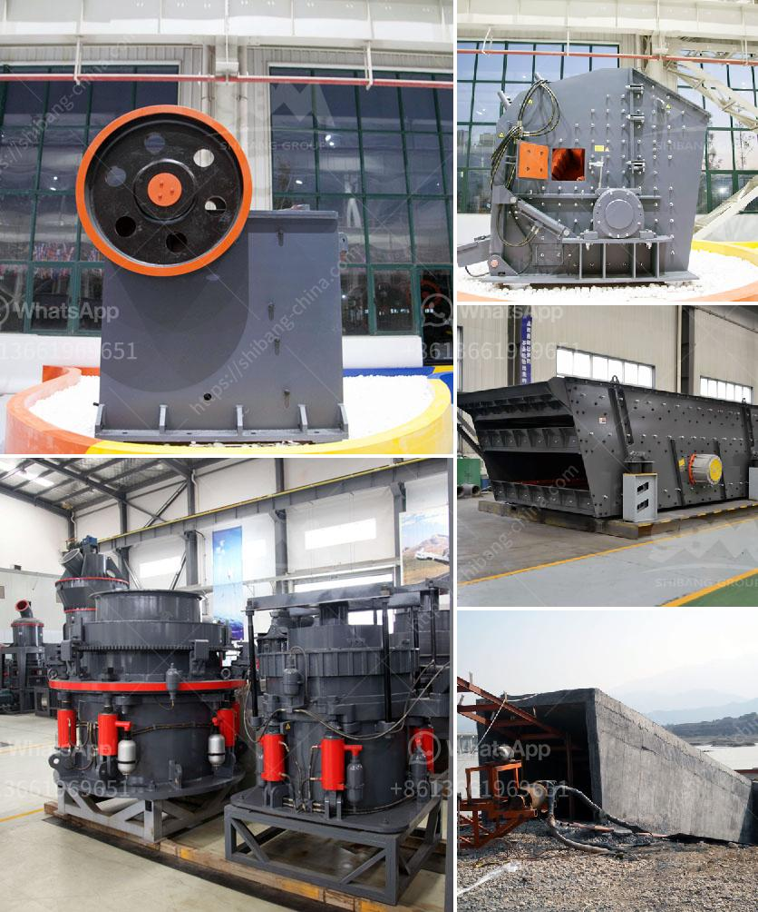

<h3>cost to setup cement plant industry</h3>
The cement industry is an important sector in the construction field, providing the essential ingredient for various building materials and infrastructure projects. Setting up a cement plant requires substantial investment, expertise, and meticulous planning to ensure successful operations in the long run.

The cost to set up a cement plant industry primarily depends on several factors, including the location, size, and type of the plant, as well as the level of automation and technology involved. It is crucial to conduct a detailed feasibility study and project analysis to determine the overall budget required. Generally, the cost can range from millions to billions of dollars.

One of the primary expenses in establishing a cement plant is procuring the land and acquiring all the necessary permits and licenses, which could vary depending on the region and local regulations. The size of the plant also plays a significant role in the overall cost, as larger plants require more resources and infrastructure.

Furthermore, the cost of machinery and equipment is a crucial component to consider. Cement production involves various processes, including crushing, grinding, raw material mixing, clinker formation, and packaging. Each step requires specialized machinery and equipment, contributing to the overall cost.

Additionally, energy consumption is a considerable expense. Cement plants are generally energy-intensive, necessitating a reliable source of electricity. Developing an energy-efficient plant can significantly reduce long-term operational costs.

Labor costs form another substantial portion of the setup cost. Skilled manpower is crucial for operating the plant effectively. From engineers and technicians to machinery operators and administrative staff, recruiting, training, and retaining competent employees is essential.

Lastly, incorporating modern technology and automation can enhance the efficiency and productivity of a cement plant. However, it adds to the capital investment required.

In summary, establishing a cement plant industry entails significant investment in land, permits, machinery, energy consumption, labor, and technology. A comprehensive feasibility study is crucial to determine the overall cost, and meticulous planning is necessary to ensure the successful setup and long-term profitability of the plant.
<h3>Contact us</h3><ul><li><strong>Whatsapp:&nbsp;<a href="https://wa.me/8613661969651">+8613661969651</a></strong></li><li><a href="https://swt.shibang-china.com/?git&amp;zhl&amp;cost to setup cement plant industry"><strong>Online Service(chat now)</strong></a></li></ul><h3>Related</h3><ul><li><a href='stone crusher price.md'>stone crusher price</a></li><li><a href='jaw crusher baxter.md'>jaw crusher baxter</a></li><li><a href='prices of copper smelting plant.md'>prices of copper smelting plant</a></li><li><a href='mill for gold mining operation.md'>mill for gold mining operation</a></li><li><a href='quick lime production process.md'>quick lime production process</a></li></ul>