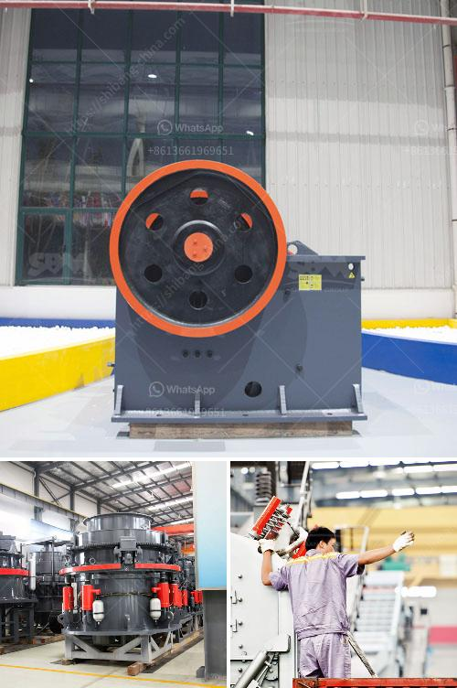

<h3>costo de instalacion de planta de cemento</h3>
El costo de instalación de una planta de cemento es un aspecto fundamental a considerar para aquellos que deseen invertir en la industria de la construcción. Esta inversión puede ser bastante significativa y se estima que el costo promedio de instalación de una planta de cemento oscila entre varios millones de dólares.

El principal factor que influye en el costo de instalación es el tamaño de la planta de producción de cemento. Una planta más grande requerirá una mayor inversión, ya que se necesitarán más equipos y maquinaria para satisfacer la demanda. Por otro lado, una planta más pequeña requerirá una inversión menor, pero puede no ser capaz de producir en gran escala.

Otro aspecto a considerar en el costo de instalación es la ubicación de la planta. La proximidad a las fuentes de materias primas, como la piedra caliza y la arcilla, puede reducir los gastos de transporte y abastecimiento. Además, una planta ubicada cerca de los centros de demanda puede reducir los costos de distribución.

Los costos de instalación también incluyen la contratación de mano de obra especializada, la adquisición de los permisos necesarios, los estudios de impacto ambiental y el desarrollo de infraestructuras, como el suministro de agua y energía.

Es importante mencionar que estos costos de instalación pueden variar dependiendo del país y las regulaciones locales. También es esencial considerar los costos operativos a largo plazo, como el mantenimiento de los equipos y la contratación de personal calificado.

En resumen, el costo de instalación de una planta de cemento puede ser una inversión considerable, que varía según el tamaño de la planta, la ubicación y los factores regulatorios. Estos costos deben considerarse cuidadosamente antes de embarcarse en este tipo de proyecto para asegurar una inversión exitosa en la industria de la construcción.
<h3>Contact us</h3><ul><li><strong>Whatsapp:&nbsp;<a href="https://wa.me/8613661969651">+8613661969651</a></strong></li><li><a href="https://swt.shibang-china.com/?git&amp;zhl&amp;costo de instalacion de planta de cemento"><strong>Online Service(chat now)</strong></a></li></ul><h3>Related</h3><ul><li><a href='portable cone crusher plant.md'>portable cone crusher plant</a></li><li><a href='best mill for wet grinding of calcium carbonate.md'>best mill for wet grinding of calcium carbonate</a></li><li><a href='automatic rolling mill manufacturer liberia.md'>automatic rolling mill manufacturer liberia</a></li><li><a href='stone crusher price of ton per day.md'>stone crusher price of ton per day</a></li><li><a href='feldspar powder machine.md'>feldspar powder machine</a></li></ul>