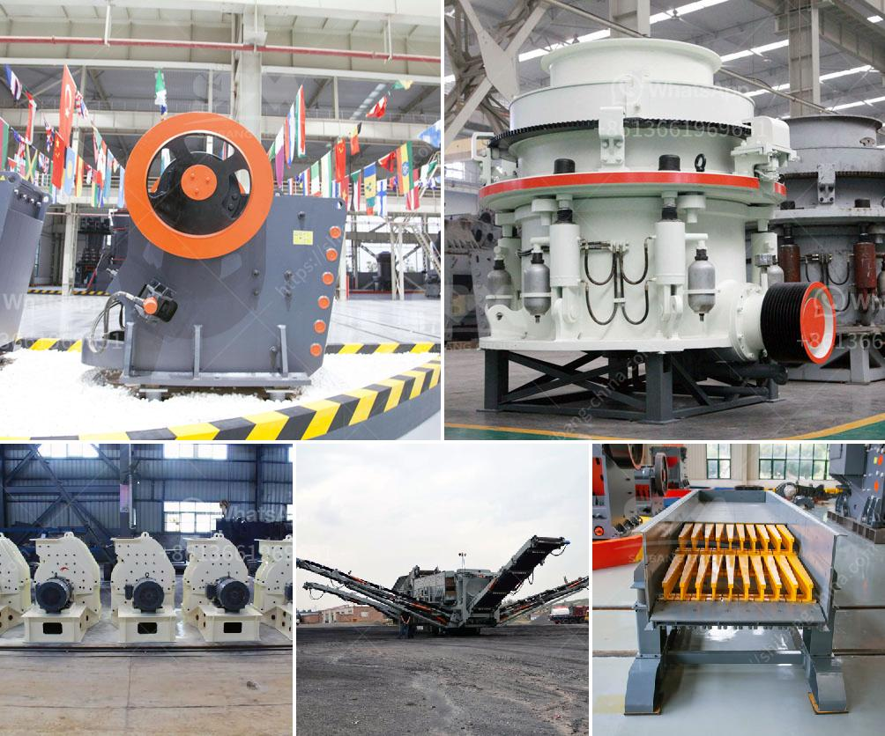

<h3>cotizacion de equipos mineros</h3>
La industria minera es una de las actividades económicas más importantes en diversos países alrededor del mundo. Para llevar a cabo la extracción de minerales de manera eficiente, segura y rentable, es esencial contar con los equipos mineros adecuados. La cotización de equipos mineros juega un papel fundamental en el proceso de adquisición de maquinarias y herramientas necesarias para el funcionamiento de una mina.

La cotización de equipos mineros consiste en determinar el costo estimado de los equipos necesarios para ejecutar las actividades de la mina. En el proceso de cotización, se deben considerar diversos factores que afectan el costo de los equipos, como la capacidad de producción, características técnicas, complejidad de la operación, mantenimiento, transporte, entre otros.

Uno de los aspectos más importantes a tener en cuenta en la cotización de equipos mineros es la calidad de los equipos. La adquisición de maquinaria y herramientas de calidad garantiza una mayor durabilidad, menor necesidad de reparaciones y un rendimiento óptimo en las actividades mineras. Es esencial evaluar detenidamente las características y especificaciones técnicas de los equipos antes de realizar la cotización.

Además de la calidad de los equipos, otro factor clave en la cotización de equipos mineros es la rentabilidad. Los equipos mineros representan una inversión significativa para las empresas mineras, por lo que es necesario evaluar cuidadosamente el costo-beneficio de la adquisición. Es importante considerar no solo el precio inicial de los equipos, sino también los costos operativos a largo plazo, como el consumo de combustible, mantenimiento, repuestos y mano de obra.

La tecnología también juega un papel fundamental en la cotización de equipos mineros. En la actualidad, existen numerosas innovaciones tecnológicas que permiten aumentar la eficiencia y la productividad en las operaciones mineras. La cotización de equipos mineros debe contemplar la incorporación de tecnología de vanguardia que permita optimizar los procesos y reducir los costos de operación.

Asimismo, es necesario considerar la disponibilidad de proveedores y distribuidores de equipos mineros confiables al momento de realizar la cotización. Contar con proveedores que ofrezcan no solo equipos de calidad, sino también un buen servicio postventa, es esencial para asegurar el correcto funcionamiento de los equipos y minimizar paradas no programadas en la mina.

En resumen, la cotización de equipos mineros es un proceso esencial para la adquisición de maquinaria y herramientas necesarias para la operación de una mina. La calidad de los equipos, la rentabilidad, la tecnología y la disponibilidad de proveedores confiables deben ser considerados cuidadosamente en el proceso de cotización. Una cotización bien realizada garantiza una mayor eficiencia en las operaciones mineras y contribuye a maximizar los beneficios económicos de la industria minera.
<h3>Contact us</h3><ul><li><strong>Whatsapp:&nbsp;<a href="https://wa.me/8613661969651">+8613661969651</a></strong></li><li><a href="https://swt.shibang-china.com/?git&amp;zhl&amp;cotizacion de equipos mineros"><strong>Online Service(chat now)</strong></a></li></ul><h3>Related</h3><ul><li><a href='cost of barite crusher in nigeria.md'>cost of barite crusher in nigeria</a></li><li><a href='vertical coal mill single diagram.md'>vertical coal mill single diagram</a></li><li><a href='gold mining mills in south africa.md'>gold mining mills in south africa</a></li><li><a href='gold processing in philippines.md'>gold processing in philippines</a></li><li><a href='stone crusher vibrating screen for sale.md'>stone crusher vibrating screen for sale</a></li></ul>