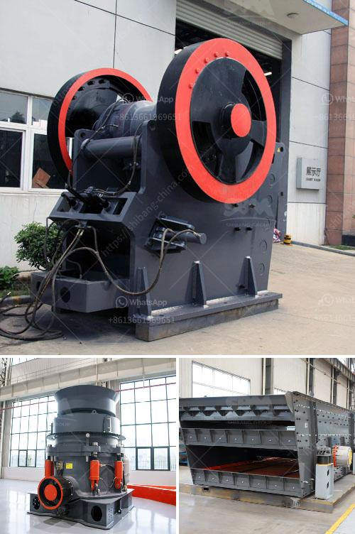

<h3>cracker roller mill limestone</h3>
The cracker roller mill is a finely crushing machine used extensively in the limestone processing industry. It features advanced technology, flexible operation, and high efficiency. The cracker roller mill is widely used in the new industrial fields of urban construction waste recycling, mining, metallurgy, chemical industry, and cement production. It is an ideal equipment for crushing and large-scale grinding of various materials, such as limestone.

Limestone, with its excellent physical and chemical properties, is widely used in various industries. It is an essential raw material in industries such as construction, agriculture, chemical, and environmental protection. In production, limestone needs to be crushed and ground into powder to meet different application requirements.

The cracker roller mill limestone crushing technology advanced, with excellent crushing effect, and is efficient in limestone processing, making it popular among customers. The cracker roller mill is widely used in the new industrial fields of urban construction waste recycling, mining, metallurgy, chemical industry, and cement production. It is an ideal equipment for crushing and large-scale grinding of various materials, such as limestone.

The cracker roller mill limestone has a high level of automation, which can be remotely controlled and monitored. The operation is simple, and the equipment has a long service life, reducing maintenance costs. It also has a stable performance, large crushing ratio, and high efficiency.

With the development of modern technology, the cracker roller mill limestone crushing technology has been continuously improved. It provides a guarantee for the rapid development of the limestone processing industry. The cracker roller mill limestone not only meets the requirements of environmental protection but also improves the quality of limestone processed products. With the continuous upgrading of technology, the cracker roller mill limestone will play an even more important role in the limestone processing industry.

In conclusion, the cracker roller mill limestone is an essential machine in the limestone processing industry. With advanced technology, flexible operation, and high efficiency, it has become popular among customers. The cracker roller mill limestone not only meets the requirements of environmental protection but also improves the quality of limestone processed products. As technology continues to develop, the cracker roller mill limestone will continue to play a vital role in the limestone processing industry.
<h3>Contact us</h3><ul><li><strong>Whatsapp:&nbsp;<a href="https://wa.me/8613661969651">+8613661969651</a></strong></li><li><a href="https://swt.shibang-china.com/?git&amp;zhl&amp;cracker roller mill limestone"><strong>Online Service(chat now)</strong></a></li></ul><h3>Related</h3><ul><li><a href='jaw crusher diagram.md'>jaw crusher diagram</a></li><li><a href='adjustement of gradation at crusher plant.md'>adjustement of gradation at crusher plant</a></li><li><a href='copper concentrate mobile crusher.md'>copper concentrate mobile crusher</a></li><li><a href='aggregate crusher plants.md'>aggregate crusher plants</a></li><li><a href='consol glass recycling price list south africa.md'>consol glass recycling price list south africa</a></li></ul>