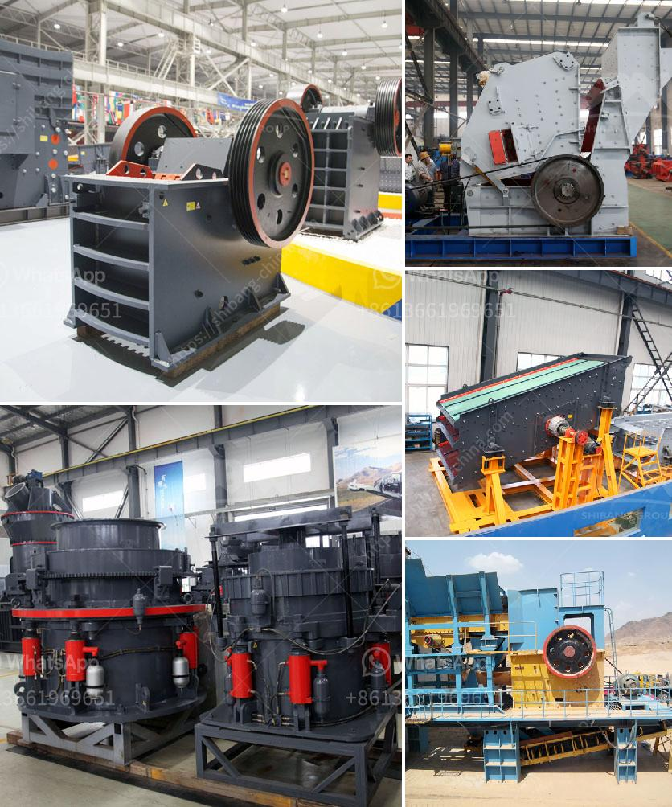

<h3>crankshaft of a jaw crusher</h3>
The crankshaft is one of the most important parts of jaw crusher, the transmission device of jaw crusher. Properly lubricating and maintaining the crankshaft is an important step to ensure the long-term normal operation of the jaw crusher. So, what are the main points of attention for the lubrication and maintenance of the crankshaft of the jaw crusher?

Firstly, the crankshaft needs regular lubrication. The lubrication of the jaw crusher's crankshaft is very important. The crankshaft bearing of jaw crusher is commonly lubricated by the lithium-based grease or motor oil in the moderate and cold climate. If the temperature is too high, the oil has to be used, so that the viscosity of the oil can be guaranteed. The lubricating oil used in the jaw crusher's crankshaft bearing should be lower than 45℃ in temperature, and should be replaced every 3-6 months.

Secondly, the crankshaft needs to be maintained regularly. The jaw crusher's crankshaft is frequently worn due to the abrasion caused by the eccentric shaft sleeve, resulting in loosening and fracture. Therefore, it is necessary to make timely maintenance and strengthen the inspection. Regularly check whether the crankshaft is loose, whether the bolts are tightened, whether there are any cracks, and if found, timely repair them to avoid excessive wear or accidents during use.

In addition, during the maintenance of the crankshaft, attention should also be paid to the balance of the crankshaft. The balance of the crankshaft is directly related to the operation of the jaw crusher. If the crankshaft is unbalanced, it will cause the equipment to shake during operation, resulting in an increase in power consumption and reduced production efficiency. Therefore, it is necessary to regularly check the balance of the crankshaft and adjust it in time if it is found to be unbalanced.

Furthermore, the wear and tear of the crankshaft can be reduced through proper use and maintenance. When using the jaw crusher, it is necessary to follow the operating instructions and ensure that the crusher is operated within the prescribed range to reduce the excessive load on the crankshaft and avoid unnecessary wear. Regularly clean the dust and debris in the bearing to prevent the small particles from entering and causing damage to the crankshaft. Replace the damaged parts in time to avoid causing greater damage to the crankshaft.

To summarize, the crankshaft is one of the key components of the jaw crusher, and its lubrication and maintenance play a crucial role in the long-term normal operation of the crusher. Proper lubrication can reduce the wear and tear of the crankshaft, while regular maintenance can effectively prevent accidents and improve the production efficiency of the equipment. Therefore, it is necessary to pay attention to the lubrication and maintenance of the crankshaft to ensure the reliable operation of the jaw crusher.
<h3>Contact us</h3><ul><li><strong>Whatsapp:&nbsp;<a href="https://wa.me/8613661969651">+8613661969651</a></strong></li><li><a href="https://swt.shibang-china.com/?git&amp;zhl&amp;crankshaft of a jaw crusher"><strong>Online Service(chat now)</strong></a></li></ul><h3>Related</h3><ul><li><a href='screening plant for hire south africa.md'>screening plant for hire south africa</a></li><li><a href='hard rock crusher.md'>hard rock crusher</a></li><li><a href='coal processing machine.md'>coal processing machine</a></li><li><a href='stone crusher supplier company.md'>stone crusher supplier company</a></li><li><a href='mobile stone crushing plant.md'>mobile stone crushing plant</a></li></ul>