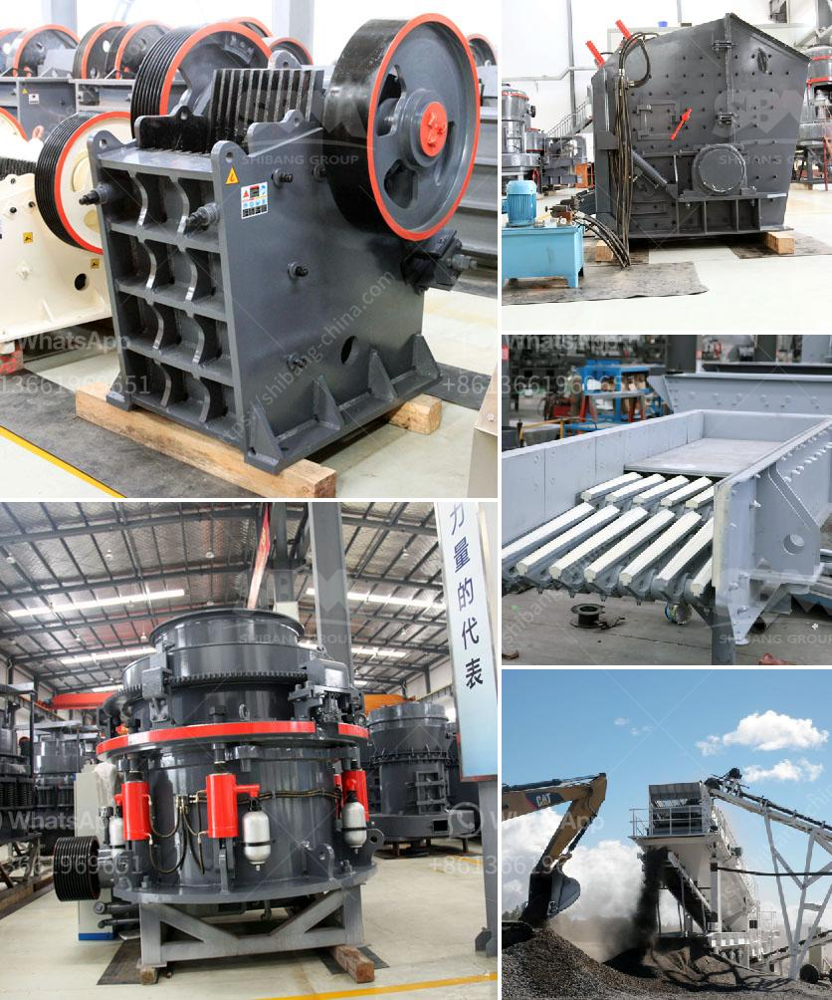

<h3>crasher sand machine south africa</h3>
In South Africa, the construction industry plays a crucial role in the nation's economic growth and development. With rapid urbanization and infrastructure development taking place, the demand for building materials is at an all-time high. One particular material that is in great demand is sand, which is used for various construction purposes. To meet this demand, the crasher sand machine has emerged as an innovative solution.

The crasher sand machine, also known as a sand crusher machine, is a type of crushing equipment that utilizes impact energy to reduce the size of sand particles. This machine is commonly used in mining, metallurgy, construction, and other industries that require sand for building projects. Its main function is to crush larger size stones into sand-sized particles that can be used as a construction material.

One of the key advantages of the crasher sand machine is its efficient and rapid sand production capabilities. Unlike traditional sand mining methods, which involve labor-intensive processes such as dredging or manual extraction, the crasher sand machine enables large quantities of sand to be produced in a relatively short period. This not only reduces the time and labor required to obtain sand but also cuts down on costs.

Moreover, the crasher sand machine is designed to produce high-quality sand that meets the specifications required for construction purposes. The machine is equipped with special crushing chambers and high-speed rotating impact plates, which ensure that the sand produced is of desired size and shape. This ensures that the sand is free from impurities and has the right consistency for use in concrete, asphalt, and other construction materials.

Another significant advantage of the crasher sand machine is its environmental friendliness. Unlike traditional sand mining methods, which often result in ecosystem destruction and environmental pollution, this machine operates in a controlled and regulated manner. It does not require large-scale excavation or the use of harmful chemicals, making it a more sustainable option for obtaining construction sand.

The crasher sand machine has gained popularity in South Africa due to its numerous benefits. Construction companies and contractors in the country are increasingly using this machine to obtain sand for their projects. By utilizing the crasher sand machine, they can meet the growing demand for sand while adhering to environmental regulations and minimizing their ecological footprint.

However, it is essential to note that while the crasher sand machine offers numerous advantages, it is not a complete solution to South Africa's sand supply challenges. The country still needs to develop sustainable strategies for sand extraction, management, and conservation to ensure the long-term availability of this crucial construction material.

In conclusion, the crasher sand machine has emerged as a game-changer in the construction industry in South Africa. It provides an efficient, cost-effective, and environmentally friendly solution for obtaining sand for building projects. As the demand for sand continues to rise, this machine will continue to play a crucial role in meeting the nation's building material needs, contributing to sustainable development and economic growth.
<h3>Contact us</h3><ul><li><strong>Whatsapp:&nbsp;<a href="https://wa.me/8613661969651">+8613661969651</a></strong></li><li><a href="https://swt.shibang-china.com/?git&amp;zhl&amp;crasher sand machine south africa"><strong>Online Service(chat now)</strong></a></li></ul><h3>Related</h3><ul><li><a href='jaw crusher plant in saudi.md'>jaw crusher plant in saudi</a></li><li><a href='mining quarry equipment for sale sri lanka.md'>mining quarry equipment for sale sri lanka</a></li><li><a href='roller mill cement price.md'>roller mill cement price</a></li><li><a href='ball mill prices and for sale ghana.md'>ball mill prices and for sale ghana</a></li><li><a href='changing jaw on a crusher.md'>changing jaw on a crusher</a></li></ul>