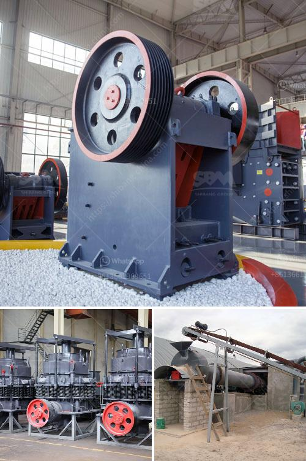

<h3>crawler mobile crushing plants</h3>
Crawler mobile crushing plants are increasingly being used in mining and construction industries due to their continuous operation capability, ease of transportation, and competitive pricing. These machines are designed to crush large rocks, ore, concrete, or asphalt into smaller pieces for further processing.

One of the key benefits of crawler mobile crushing plants is their ability to move around a site quickly. They can be easily transported from one location to another, making them ideal for projects in remote areas or sites with limited accessibility. This mobility allows operators to bring the crushing plants closer to the material source, reducing transportation costs and time.

The crawler mobile crushing plants are equipped with heavy-duty crawler chassis systems that enable them to withstand the harsh conditions of the mining or construction site. The chassis design ensures stability and durability, while the tracks provide excellent traction, allowing the machine to operate on different terrains without any difficulty.

These machines are also known for their high crushing capacity. They are equipped with powerful crushers that can handle a wide range of materials, including rocks, concrete, and asphalt. The crushers are designed to deliver a high crushing ratio and consistent particle size, resulting in superior product quality. This makes the crawler mobile crushing plants suitable for various applications, such as primary crushing, secondary crushing, and fine crushing.

In addition to their crushing capabilities, crawler mobile crushing plants are also equipped with advanced screening systems. These systems ensure the production of high-quality end products by separating and classifying the crushed material according to its size. The screening process removes any unwanted particles and helps to achieve the desired product specifications.

Another advantage of crawler mobile crushing plants is their fuel efficiency. These machines are designed to optimize fuel consumption by incorporating advanced technologies, such as automatic engine start/stop, energy-saving hydraulic systems, and intelligent control systems. As a result, operators can reduce their operating costs and minimize environmental impact.

Furthermore, the maintenance and servicing of crawler mobile crushing plants are relatively straightforward. The machines are designed with easy access to crucial components, such as the engine, hydraulic system, and crusher chamber. This allows for quick and effective inspection, maintenance, and repair, ensuring minimal downtime and maximum productivity.

In conclusion, crawler mobile crushing plants have revolutionized the mining and construction industries by offering a versatile, mobile, and efficient solution for crushing and screening requirements. Their ability to move quickly, high crushing capacity, fuel efficiency, and easy maintenance make them an attractive choice for various applications. As technology continues to advance, we can expect to see further improvements in the performance and features of crawler mobile crushing plants.
<h3>Contact us</h3><ul><li><strong>Whatsapp:&nbsp;<a href="https://wa.me/8613661969651">+8613661969651</a></strong></li><li><a href="https://swt.shibang-china.com/?git&amp;zhl&amp;crawler mobile crushing plants"><strong>Online Service(chat now)</strong></a></li></ul><h3>Related</h3><ul><li><a href='silica sand mining equipment.md'>silica sand mining equipment</a></li><li><a href='vibrating screens manufacturer south africa.md'>vibrating screens manufacturer south africa</a></li><li><a href='cheap used jaw rock crushers for sale.md'>cheap used jaw rock crushers for sale</a></li><li><a href='list of machinery used in cement plant.md'>list of machinery used in cement plant</a></li><li><a href='how to build a stone crusher.md'>how to build a stone crusher</a></li></ul>