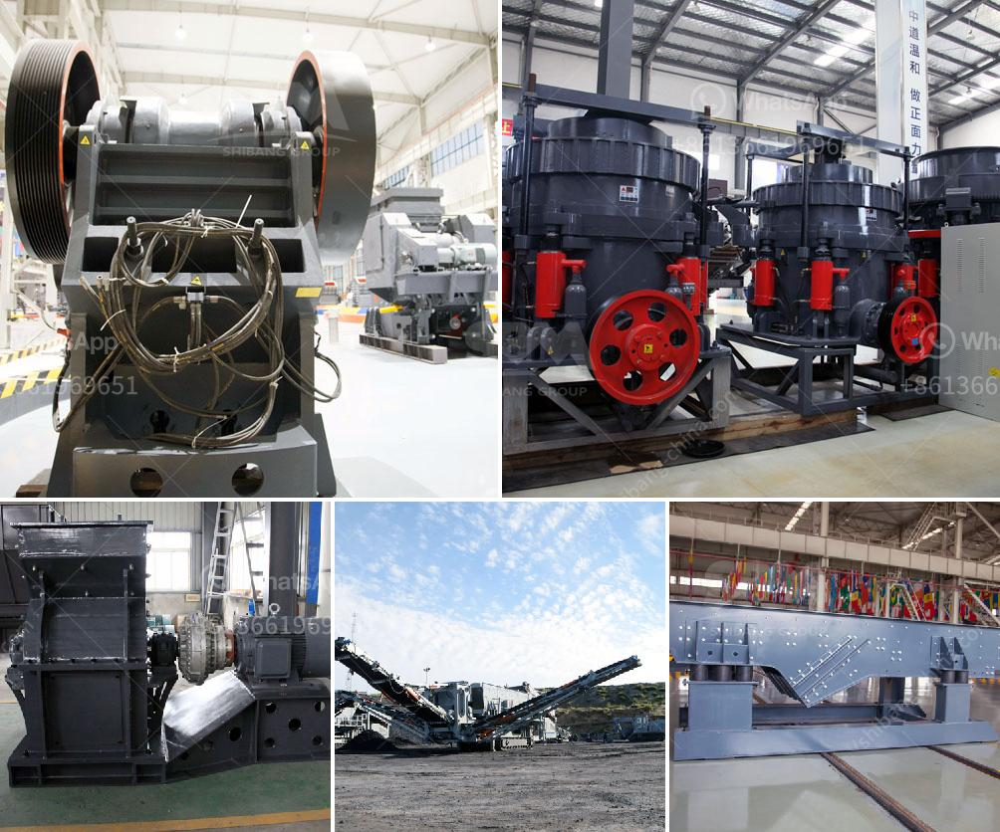

<h3>crush rock industries nigeria</h3>
Crush Rock Industries Nigeria Limited is a quarry company in Abuja, Nigeria that manufactures a range of building and construction materials. The company is proud to be one of the major producers of construction materials in Nigeria. Crush Rock Industries Nigeria Limited is known for providing high-quality products, excellent customer service, and on-time delivery to its customers.

Established in 1992, Crush Rock Industries Nigeria Limited has grown steadily and has gained a reputation for creating value for its customers. The company operates several quarries and crushing plants in different locations across Nigeria. This allows them to meet the increasing demands for aggregate materials, such as crushed stone, gravel, and sand.

Crush Rock Industries Nigeria Limited offers a wide range of crushed rock aggregates for different construction purposes. From road base materials to decorative stone, the company provides various options to suit the diverse needs of its clients. They also offer concrete products such as blocks and precast slabs, which are essential components in the construction industry.

One of the reasons why Crush Rock Industries Nigeria Limited stands out from its competitors is its commitment to quality control. The company ensures that its products meet the highest industry standards by implementing strict quality control processes. Each quarry undergoes regular inspections and testing to ensure the consistent quality of raw materials. The aggregates are carefully processed using state-of-the-art equipment to ensure uniformity and precision in grading.

Furthermore, Crush Rock Industries Nigeria Limited is committed to environmentally sustainable practices. The company takes measures to minimize its impact on the environment by implementing proper waste management systems and adopting eco-friendly production techniques.

In addition to its products, Crush Rock Industries Nigeria Limited prides itself on its excellent customer service. The company has a team of knowledgeable and dedicated professionals who assist clients in selecting the right materials for their projects. They provide guidance and recommendations based on the specific requirements of each customer. Whether it's a small residential project or a large-scale infrastructure development, the company ensures that its customers receive personalized attention and all their needs are met.

Moreover, Crush Rock Industries Nigeria Limited pays great attention to timely delivery. The company understands the importance of meeting project deadlines, and therefore, it maintains a reliable distribution network. This allows them to transport materials efficiently and deliver them to the customers' sites on schedule.

In conclusion, Crush Rock Industries Nigeria Limited is a reputable quarry company that has been satisfying the construction industry's needs for nearly three decades. With its high-quality products, excellent customer service, and on-time delivery, the company has established itself as a trusted partner in the construction industry. Crush Rock Industries Nigeria Limited continues to strive for excellence and contribute to the development of Nigeria's infrastructure.
<h3>Contact us</h3><ul><li><strong>Whatsapp:&nbsp;<a href="https://wa.me/8613661969651">+8613661969651</a></strong></li><li><a href="https://swt.shibang-china.com/?git&amp;zhl&amp;crush rock industries nigeria"><strong>Online Service(chat now)</strong></a></li></ul><h3>Related</h3><ul><li><a href='static jaw crusher for sale.md'>static jaw crusher for sale</a></li><li><a href='rock crusher plant cost.md'>rock crusher plant cost</a></li><li><a href='cost of equipment used in mining lead ore.md'>cost of equipment used in mining lead ore</a></li><li><a href='hard rock crusher.md'>hard rock crusher</a></li><li><a href='barite crusher processing plant.md'>barite crusher processing plant</a></li></ul>