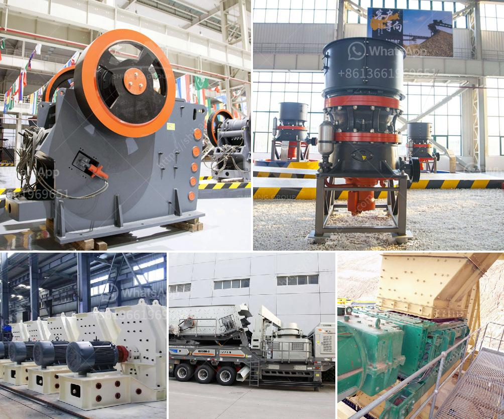

<h3>crushed sand manufacturing</h3>
In recent years, the burgeoning demand for construction materials has spurred a wave of innovation within the industry. With traditional sources of sand becoming scarce and unsustainable, the manufacturing of crushed sand has emerged as a viable and eco-friendly alternative. This article delves into the process and benefits of manufacturing crushed sand, and how it is revolutionizing the construction landscape.

Crushed sand, also known as artificial sand, is produced by crushing rocks to a specific size and texture. The particles are then washed and classified for use as construction sand, thereby providing a sustainable alternative to natural sand. Crushed sand offers several advantages over its natural counterpart, including uniformity, improved strength, and reduced environmental impact.

Firstly, the manufacturing process ensures uniformity in terms of size and shape, which is difficult to achieve with natural sand. The presence of uniform particles enhances the workability of concrete mixtures, resulting in robust structures and superior surface finishes. Furthermore, crushed sand undergoes a washing and grading process, guaranteeing that impurities and clay particles are removed, thereby ensuring a clean and reliable construction material.

One of the primary benefits of manufacturing crushed sand is its ability to address the growing concerns surrounding the depletion of riverbeds. Traditional sand mining has resulted in severe ecological damage, impacting aquatic ecosystems and disrupting natural habitats. By producing crushed sand, construction companies can reduce their reliance on riverbed sand, thereby preserving these fragile ecosystems.

Moreover, the use of crushed sand aids in conserving water, another precious resource. Since crushed sand can be manufactured at the point of use, transportation costs are significantly reduced, resulting in less pressure on fuel consumption and a smaller carbon footprint. Additionally, the process of manufacturing crushed sand requires less water compared to traditional sand mining operations, making it a more sustainable choice.

Crushed sand proves to be an excellent alternative in various construction applications. It can be used as a replacement for natural sand in concrete production, resulting in stronger and more durable structures. Crushed sand also finds applications in road construction as a base layer or sub-base material, improving the pavement's overall longevity and stability.

Another innovative application of crushed sand is seen in the manufacturing of precast concrete products. The uniformity and cleanliness of crushed sand make it ideal for producing high-quality precast components, ensuring consistent strength and finish.

The concept of manufacturing crushed sand showcases the construction industry's commitment to sustainability and innovation. Through this process, construction projects can not only achieve superior quality and strength but also reduce their impact on the environment. The production of crushed sand offers solutions to address the environmental challenges associated with traditional sand mining and enables the preservation of natural resources for future generations. As the growing demand for construction materials persists, crushed sand manufacturing is set to pave the way for a greener and more sustainable future in the construction industry.
<h3>Contact us</h3><ul><li><strong>Whatsapp:&nbsp;<a href="https://wa.me/8613661969651">+8613661969651</a></strong></li><li><a href="https://swt.shibang-china.com/?git&amp;zhl&amp;crushed sand manufacturing"><strong>Online Service(chat now)</strong></a></li></ul><h3>Related</h3><ul><li><a href='used coal washing plant sale.md'>used coal washing plant sale</a></li><li><a href='ball mill for silica grinding made in japan.md'>ball mill for silica grinding made in japan</a></li><li><a href='crushing efficiency of ball mill.md'>crushing efficiency of ball mill</a></li><li><a href='cement ball mills charging.md'>cement ball mills charging</a></li><li><a href='gypsum granules machine in india.md'>gypsum granules machine in india</a></li></ul>