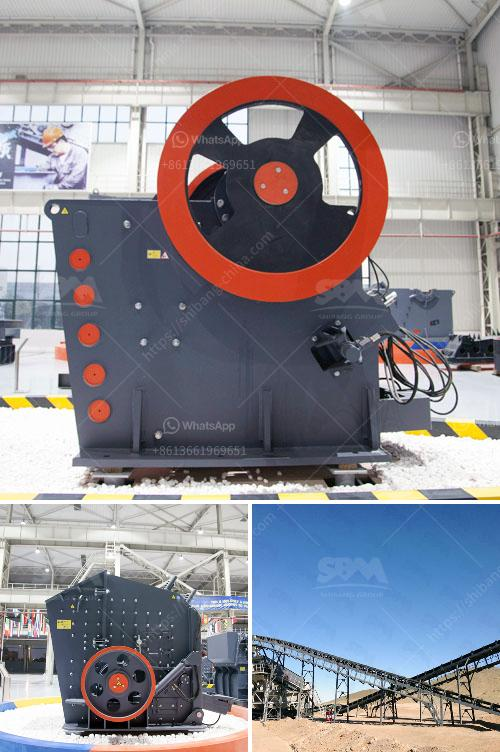

<h3>crushed stone plant peru</h3>
Peru is a country widely known for its rich natural resources, including copper, gold, silver, and zinc. However, one of its lesser-known but equally important resources is crushed stone. The country boasts a thriving crushed stone industry that plays a crucial role in its infrastructure development and construction projects.

A crushed stone plant in Peru is a facility where stone is processed and crushed into various sizes for multiple applications. These plants extract raw materials from quarries, crush them into smaller pieces using heavy machinery, and then sort and categorize them for different uses.

The process of producing crushed stone involves several stages. First, the stone is blasted and excavated from quarries using controlled explosions. Once extracted, the stone is loaded onto dump trucks and transported to the crushing plant. At the plant, the stones are fed into a primary crusher that breaks them into smaller sizes. The crushed material then passes through secondary and tertiary crushers to achieve the desired size.

One of the key applications of crushed stone in Peru is road construction. The country's expanding road network requires a constant supply of high-quality crushed stone. It is used as a base and sub-base material for roads, providing stability and durability. The crushed stone acts as a foundation, supporting the weight of vehicles and ensuring the road's longevity.

Additionally, crushed stone is crucial for concrete production. It serves as an aggregate, along with sand and cement, to form concrete mixtures. These mixtures are used for constructing buildings, bridges, and other structures. Crushed stone provides strength and stability to the concrete, making it a vital component in the construction industry.

Moreover, crushed stone is used for railway ballast. Railways require a solid foundation to support the tracks and maintain stability. Crushed stone acts as ballast, providing a strong and stable base for the tracks, ensuring the smooth and safe operation of trains.

The crushed stone industry in Peru not only contributes to infrastructure development but also generates employment opportunities. These plants employ skilled workers who operate heavy machinery, ensuring the efficient and safe production of crushed stone.

Furthermore, the industry plays a significant role in Peru's economy. The revenue generated from the sale of crushed stone contributes to the country's GDP, creating a sustainable economy and promoting growth. Moreover, the availability of crushed stone locally reduces reliance on imports, promoting self-sufficiency in construction materials.

However, the extraction and production of crushed stone must be carried out responsibly, taking into consideration environmental and social impacts. Mining activities should be regulated and monitored to minimize ecological damage. Additionally, measures should be in place to ensure the safety and well-being of workers in the plants.

In conclusion, the crushed stone industry in Peru plays a pivotal role in the country's infrastructure development and construction projects. It provides essential materials for road construction, concrete production, and railway ballast. The industry contributes to the country's economy and generates employment opportunities. However, responsible practices must be followed to ensure sustainable development and minimize negative impacts.
<h3>Contact us</h3><ul><li><strong>Whatsapp:&nbsp;<a href="https://wa.me/8613661969651">+8613661969651</a></strong></li><li><a href="https://swt.shibang-china.com/?git&amp;zhl&amp;crushed stone plant peru"><strong>Online Service(chat now)</strong></a></li></ul><h3>Related</h3><ul><li><a href='price of zenith mining.md'>price of zenith mining</a></li><li><a href='gold processing equipment.md'>gold processing equipment</a></li><li><a href='calcium carbonate for ball mill.md'>calcium carbonate for ball mill</a></li><li><a href='mobile crusher stone.md'>mobile crusher stone</a></li><li><a href='grinding machinery manufecture in africa.md'>grinding machinery manufecture in africa</a></li></ul>