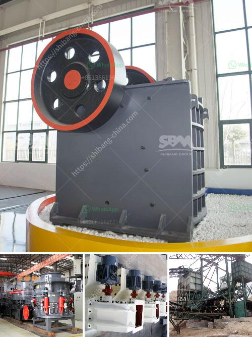

<h3>crusher and screening plants for sale</h3>
Crusher and screening plants are crucial in the construction industry. They help break down large rocks and stones into smaller, more manageable sizes, making it easier to transport and use for various projects. These plants are essential for crushing materials like limestone, granite, and sandstone, which are commonly used in roads, buildings, and other infrastructure.

If you're in the market for a crusher or screening plant, there are several options available. Many manufacturers offer a wide range of plants to meet different needs and budgets. Some popular types include jaw crushers, impact crushers, cone crushers, and vibrating screens.

Jaw crushers are ideal for primary crushing. They have a fixed jaw plate and a moving jaw plate, which create a wedge-like opening to squeeze the material against the stationary plate. This process helps break down the material into smaller pieces.

On the other hand, impact crushers are suitable for secondary or tertiary crushing. They use the principle of impact to reduce the size of the material. These crushers have a high-speed rotor that imparts kinetic energy to the material, causing it to break upon impact.

Cone crushers, as the name suggests, have a cone-shaped crushing chamber. They are commonly used for tertiary or quaternary crushing. The material is fed into the chamber and crushed between the mantle and concave.

To complement the crushers, screening plants are used to separate the crushed material into different sizes. This is crucial for producing the required product for construction projects. Vibrating screens are commonly used for this purpose. They have multiple decks and screens of varying sizes, allowing the material to be sorted according to size.

When looking for crusher and screening plants for sale, there are a few factors to consider. Firstly, determine the type and size of material you will be crushing and screening. This will help you choose the appropriate plant for your needs. It's also essential to consider the capacity of the plant – how much material it can handle in a given period.

Additionally, consider the mobility of the plant. Some plants are stationary and are installed permanently in one location, while others are portable and can be easily transported from one site to another. The choice depends on the specific requirements of your projects.

Price is another important consideration. Crusher and screening plants come in various price ranges, depending on their capabilities and features. It's crucial to compare prices and quality from different manufacturers to ensure you get the best value for your investment.

It's also advisable to check the reputation and customer reviews of the manufacturer before making a purchase. Look for a company with a proven track record of producing high-quality plants and providing excellent customer service. This will ensure that your plant is durable, efficient, and reliable.

In conclusion, crusher and screening plants are essential equipment in the construction industry. They help break down rocks and stones into smaller sizes, making them easier to transport and use for construction projects. When purchasing a crusher or screening plant, consider factors such as the type of material you will be processing, the capacity of the plant, mobility, price, and the reputation of the manufacturer. With careful consideration, you can find the perfect plant that meets your needs and helps you complete your projects efficiently.
<h3>Contact us</h3><ul><li><strong>Whatsapp:&nbsp;<a href="https://wa.me/8613661969651">+8613661969651</a></strong></li><li><a href="https://swt.shibang-china.com/?git&amp;zhl&amp;crusher and screening plants for sale"><strong>Online Service(chat now)</strong></a></li></ul><h3>Related</h3><ul><li><a href='jaw crusher vs gyratory crusher stone crusher quarry.md'>jaw crusher vs gyratory crusher stone crusher quarry</a></li><li><a href='roller mill cement price.md'>roller mill cement price</a></li><li><a href='ball grinding mill buy.md'>ball grinding mill buy</a></li><li><a href='business plan south africa stone crusher.md'>business plan south africa stone crusher</a></li><li><a href='thailand about stone crusher plant.md'>thailand about stone crusher plant</a></li></ul>