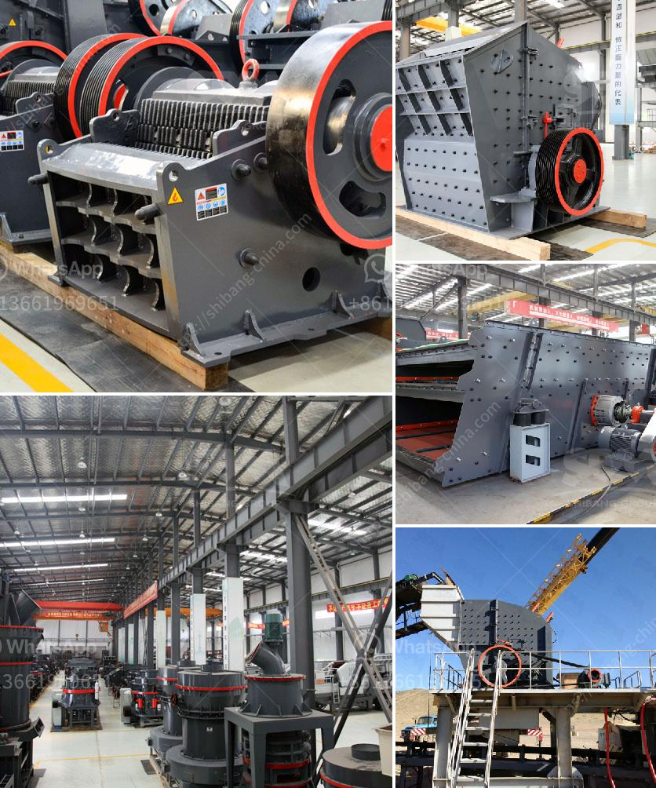

<h3>crusher cost stone crusher peru cost</h3>
When it comes to investing in a stone crusher, Peru is a promising market for many reasons. The country has a rich mining history which is one of the main driving forces behind its booming infrastructure development. With the increasing demand for construction materials, the need for efficient crushers is also on the rise.

One crucial factor to consider when buying a stone crusher in Peru is the cost. There are many variables that can affect the final price, including the type, capacity, and features of the machine. Additionally, the market conditions and seller's pricing strategy can also impact the overall cost.

The type of stone crusher you choose will significantly influence its price. There are various options available in the market, such as jaw crushers, cone crushers, impact crushers, and others. Each type has its own advantages and applications, so it's important to assess your specific needs before making a selection.

The capacity of the stone crusher is another key aspect to consider. Higher capacity crushers are generally more expensive but can handle larger quantities of material, resulting in increased productivity. If you anticipate high volumes of production, it might be worth investing in a higher capacity machine to maximize efficiency and profitability.

The features and technology incorporated into the stone crusher can also impact its cost. Advanced features like automated controls, dust suppression systems, and energy-efficient engines may raise the price but can offer long-term benefits like reduced downtime and operational costs. It is essential to evaluate these additional features and weigh their benefits against the initial investment.

The market conditions and seller's pricing strategy are also important factors to keep in mind. The cost of stone crushers can vary from one supplier to another, so it's wise to research and compare prices from different sources. Additionally, you should also consider after-sales support and warranty provided by the seller, as this can affect the overall value for money.

In conclusion, the cost of a stone crusher in Peru can vary depending on various factors such as the type, capacity, features, market conditions, and seller's pricing strategy. It is crucial to evaluate your specific requirements and thoroughly research before making a purchase. Investing in the right stone crusher can help boost productivity, streamline operations, and contribute to the country's infrastructure development.
<h3>Contact us</h3><ul><li><strong>Whatsapp:&nbsp;<a href="https://wa.me/8613661969651">+8613661969651</a></strong></li><li><a href="https://swt.shibang-china.com/?git&amp;zhl&amp;crusher cost stone crusher peru cost"><strong>Online Service(chat now)</strong></a></li></ul><h3>Related</h3><ul><li><a href='shell powder making machine grinding mill for sale.md'>shell powder making machine grinding mill for sale</a></li><li><a href='machinery crushing machine.md'>machinery crushing machine</a></li><li><a href='china gold dry washer manufacturer in australia.md'>china gold dry washer manufacturer in australia</a></li><li><a href='crusher on rent basis in nigeria.md'>crusher on rent basis in nigeria</a></li><li><a href='slag grinding machine.md'>slag grinding machine</a></li></ul>